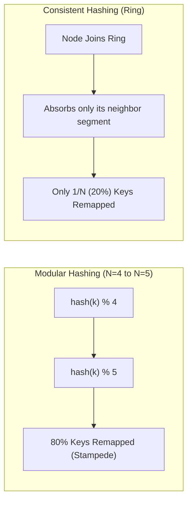
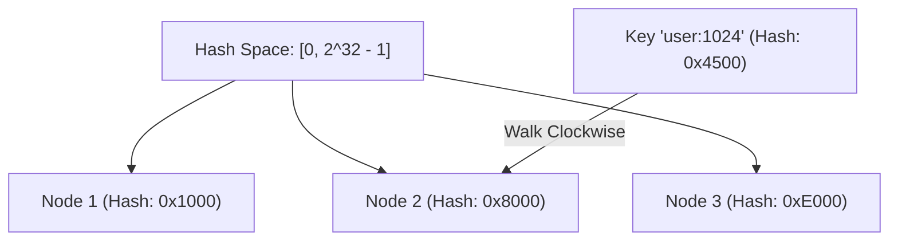
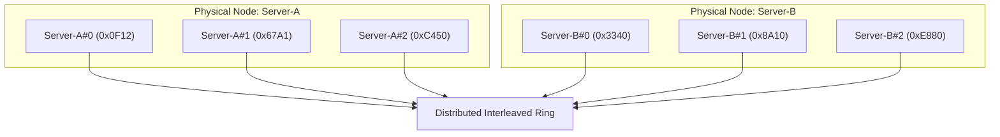

In distributed caching layers (Memcached, Redis clusters, DynamoDB), keys must be partitioned across $N$ independent nodes.

The naive approach is modular hashing:

$$
\text{node} = \text{hash}(\text{key}) \pmod N
$$

When the cluster size changes from $N$ to $N+1$, the modulo denominator shifts for almost every key. The fraction of keys that remap to a different node is:

$$
\text{Remapped Keys} = \frac{N}{N + 1}
$$

In a 4-node cluster expanding to 5 nodes, **80% of all cached keys instantly remap**. Under production load, this mass invalidation triggers a severe cache stampede that overwhelms backend databases.



## The Consistent Hash Ring

Consistent hashing (introduced by Karger et al.) solves this by mapping both **cache keys** and **physical nodes** onto a shared continuous circular integer space: $[0,\ 2^{32}-1]$.

1. Each node is hashed to one or more points on the ring.
2. A key is hashed to a point on the ring.
3. The key is assigned to the first node encountered moving clockwise ($\ge \text{hash}(\text{key})$).
4. If a key hashes past the highest node on the ring, it wraps around to the first node at index 0.

When a node joins or leaves, only the keys in the immediate adjacent range are moved. On average, only $K/N$ keys are migrated (where $K$ is the total key count and $N$ is the number of nodes).



## Virtual Nodes (Vnodes)

A known flaw in simple consistent hashing is **hash space non-uniformity**. If you place only 3 or 4 physical nodes on the ring, random hash clustering will cause one node to own 60% of the ring while another owns 10%.

To achieve uniform distribution, each physical node is replicated as $V$ **virtual nodes** on the ring (for example, hashing `node-1#0`, `node-1#1`, $\dots$, `node-1#150`):

- With $V = 10$, standard deviation of load across nodes is $\sim 30\%$.
- With $V = 150$, standard deviation of load drops below $4\%$.



## Go Implementation with Binary Search

Here is a complete, concurrency-safe consistent hash ring in Go utilizing `sort.Search` for $O(\log(N \cdot V))$ lookups:

```go
package consistenthash

import (
    "errors"
    "fmt"
    "hash/fnv"
    "slices"
    "sort"
    "strconv"
    "sync"
)

type HashFunc func(data []byte) uint32

type Ring struct {
    mu       sync.RWMutex
    hashFunc HashFunc
    vnodes   int               // virtual nodes per physical node
    ring     []uint32          // sorted slice of virtual node hashes
    nodeMap  map[uint32]string // map from virtual hash to physical node name
}

var ErrEmptyRing = errors.New("empty hash ring: no nodes configured")

func NewRing(vnodes int, fn HashFunc) *Ring {
    if fn == nil {
        fn = func(data []byte) uint32 {
            h := fnv.New32a()
            h.Write(data)
            return h.Sum32()
        }
    }
    return &Ring{
        hashFunc: fn,
        vnodes:   vnodes,
        nodeMap:  make(map[uint32]string),
    }
}

// Add inserts physical nodes with their virtual replicas
func (r *Ring) Add(nodes ...string) {
    r.mu.Lock()
    defer r.mu.Unlock()

    for _, node := range nodes {
        for i := 0; i < r.vnodes; i++ {
            vnodeKey := []byte(node + "#" + strconv.Itoa(i))
            hash := r.hashFunc(vnodeKey)
            r.ring = append(r.ring, hash)
            r.nodeMap[hash] = node
        }
    }
    slices.Sort(r.ring)
}

// Get locates the owning physical node for a given cache key
func (r *Ring) Get(key string) (string, error) {
    r.mu.RLock()
    defer r.mu.RUnlock()

    if len(r.ring) == 0 {
        return "", ErrEmptyRing
    }

    hash := r.hashFunc([]byte(key))

    // Binary search for first virtual node with hash >= key hash
    idx := sort.Search(len(r.ring), func(i int) bool {
        return r.ring[i] >= hash
    })

    // Wrap-around to index 0 if key exceeds all points on ring
    if idx == len(r.ring) {
        idx = 0
    }

    return r.nodeMap[r.ring[idx]], nil
}
```

## Replication Across Distinct Physical Nodes

In systems requiring replication (such as DynamoDB with replication factor $R = 3$), the ring walker must find $R$ **distinct physical nodes**. If two consecutive virtual nodes on the ring belong to `Server-A`, the walker skips the duplicate and continues clockwise to ensure replicas reside on distinct physical hardware.

## Key Operational Properties

1. **Deterministic Lookups**: Every client with the same node list and hash function independently computes identical key-to-node assignments without centralized routing coordination.
2. **Minimal Resharding**: Adding a node moves exactly $1/(N+1)$ of the keys, preserving 80-90% of warm cache entries across deployment scale-outs.
3. **Weight Allocation**: Heterogeneous hardware can be weighted proportionally by giving larger servers more virtual nodes (e.g. 300 vnodes for 64GB instances, 150 vnodes for 32GB instances).
