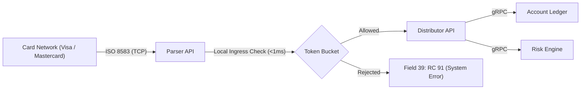
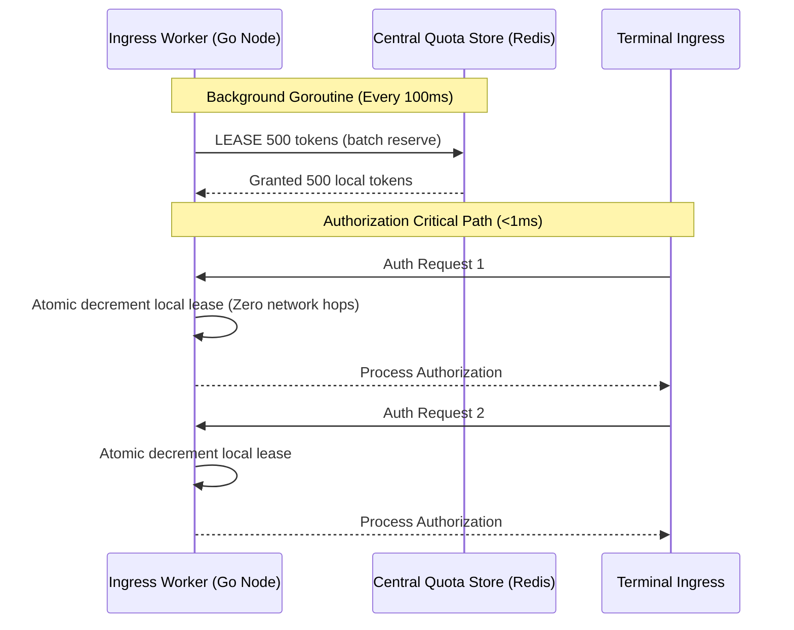

Rate limiting in payment systems operates under fundamentally different constraints than rate limiting a typical REST API.

In a standard web application, a false positive returns HTTP `429 Too Many Requests`. The client applies exponential backoff and retries. In payment authorization, a false positive declines a legitimate card transaction at a point-of-sale terminal. That means someone's groceries or transit fare is rejected.



The rate limiter must evaluate ingress traffic in **under 1 millisecond** without adding blocking remote network roundtrips to the authorization critical path.

> [!warning]
> Never block on external network calls at the card network ingress layer. Card networks enforce strict 2-second timeout windows. If your service delays responding, the network times out and initiates an automatic **reversal cascade** across acquiring and issuing banks.

## Choosing an Algorithm for Financial Ingress

### 1. Token Bucket for Global Throughput
The token bucket algorithm maintains a counter that refills continuously at a fixed rate $r$ up to capacity $C$:

$$
\text{tokens}(t) = \min\left(C,\ \text{tokens}(t_0) + r \cdot (t - t_0)\right)
$$

Set capacity $C$ to absorb anticipated flash bursts (e.g. peak Black Friday transaction volume) and refill rate $r$ to your sustained database commit capacity. Measure limits on a **per-BIN** (Bank Identification Number) and **per-merchant** partition to prevent a single misconfigured merchant terminal from starving an entire card issuer.

### 2. Sliding Window Counter for Tenant Fairness
When enforcing strict per-cardholder velocity limits (e.g. maximum 5 transactions per 60 seconds to detect card testing fraud), sliding window counters prevent boundary-burst attacks without the unbounded memory overhead of sliding window logs.

$$
\text{count} = \text{prev\_count} \times \left(1 - \frac{t_{\text{elapsed}}}{W}\right) + \text{current\_count}
$$

## Distributed Architecture: Asynchronous Token Leasing

A common architectural pitfall is making a synchronous remote Redis call (`INCR` / Lua script) on every payment authorization. Across availability zones or regions, this adds 5 to 40ms of latency, eroding your authorization SLA.



By leasing token blocks asynchronously, workers make 100% of authorization decisions against local memory in single-digit microseconds while Redis enforces cluster-wide capacity boundaries.

## Lock-Free Token Bucket Implementation in Go

Under high concurrency (100,000+ requests per second), standard `sync.Mutex` locks create severe CPU core contention. This production implementation uses atomic integer nanosecond math:

```go
package ratelimit

import (
    "sync/atomic"
    "time"
)

// AtomicTokenBucket implements a lock-free token bucket using nanosecond timestamps
type AtomicTokenBucket struct {
    capacity    int64 // Maximum tokens
    nanosPerTok int64 // Refill period per single token in nanoseconds
    state       atomic.Int64 // Packed: high 32 bits = tokens, low 32 bits = timestamp (seconds)
    lastRefill  atomic.Int64 // Unix nanoseconds of last refill
}

func NewAtomicTokenBucket(ratePerSec int64, capacity int64) *AtomicTokenBucket {
    tb := &AtomicTokenBucket{
        capacity:    capacity,
        nanosPerTok: int64(time.Second) / ratePerSec,
    }
    tb.lastRefill.Store(time.Now().UnixNano())
    tb.state.Store(capacity)
    return tb
}

func (tb *AtomicTokenBucket) Allow() bool {
    for {
        now := time.Now().UnixNano()
        last := tb.lastRefill.Load()
        tokens := tb.state.Load()

        elapsed := now - last
        if elapsed > tb.nanosPerTok {
            deltaTokens := elapsed / tb.nanosPerTok
            if deltaTokens > 0 {
                newTokens := tokens + deltaTokens
                if newTokens > tb.capacity {
                    newTokens = tb.capacity
                }
                if tb.lastRefill.CompareAndSwap(last, now-(elapsed%tb.nanosPerTok)) {
                    tb.state.Store(newTokens)
                    tokens = newTokens
                }
            }
        }

        if tokens <= 0 {
            return false
        }

        if tb.state.CompareAndSwap(tokens, tokens-1) {
            return true
        }
        // CAS failed due to concurrent consumer; retry immediately
    }
}
```

## ISO 8583 Rejection Codes & Compliance

When the rate limiter rejects an authorization, returning the correct ISO 8583 Field 39 Action Code is required to prevent merchant confusion and regulatory penalties:

| Response Code | Meaning | Network Action |
|---|---|---|
| **RC 91** (`System Error / Destination Unavailable`) | Gateway overloaded | Terminal may retry or trigger Stand-In Processing (STIP) |
| **RC 96** (`System Malfunction`) | Internal processing error | Terminal logs technical fault |
| **RC 05** (`Do Not Honor`) | Hard issuer card decline | **Never use for rate limits** (falsely signals cardholder risk) |

In financial engineering, the difference between a generic REST API and an authorization ingress is the cost of failure. Rate limiters must be fast, local-first, and semantically aligned with card network protocols.
