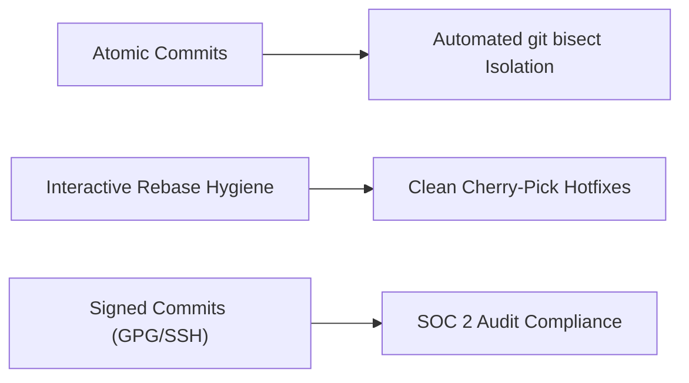
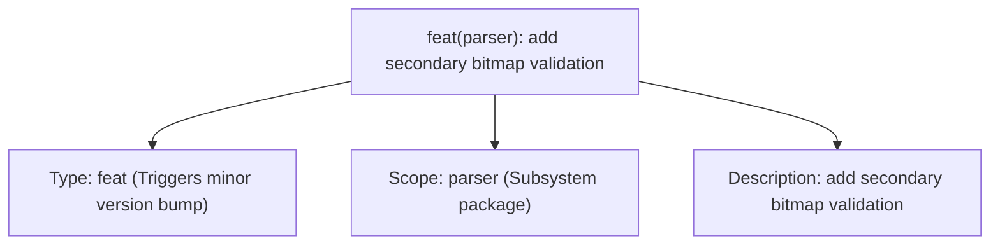
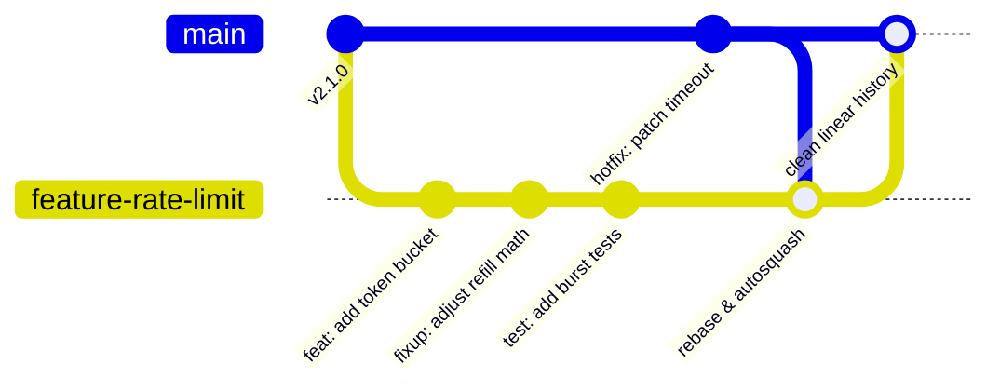

In regulated production environments (such as banking, healthcare, and infrastructure platforms), version control is not just developer tooling: it is an immutable audit log, a forensic safety net, and the foundation of automated release engineering.

Adopting structured Git practices directly impacts mean-time-to-recovery (MTTR) during production incidents and satisfies SOC 2 and PCI-DSS change-management compliance requirements.



## 1. Atomic Commits Enable Automated `git bisect`

An atomic commit represents a single, complete logical change (one bug fix, one refactor, or one feature increment) where all automated unit tests compile and pass.

When an elusive regression escapes into production, atomic commits allow automated root-cause identification using `git bisect`:

```bash
# Automatically binary search through 500 commits in ~9 steps:
git bisect start HEAD v2.4.0
git bisect run go test ./pkg/auth/...
```

If a developer bundles an unrelated schema change, a linter fix, and a business logic change into a single monolithic commit, `git bisect` cannot isolate the failure, and reverting the breaking change requires manual surgical refactoring during an active incident.

## 2. Conventional Commits for Machine-Readable History

Formatting commit headers according to the Conventional Commits specification enables automated semantic versioning (`semver`) and automated changelog generation:

```
<type>(<scope>): <short imperative description>

[optional body explaining motivation and trade-offs]

[optional footer: closes #1042, Signed-off-by: ...]
```



### Type Taxonomy
- `feat`: New user or API capability (bumps minor version in SemVer).
- `fix`: Bug remediation (bumps patch version).
- `refactor`: Internal code structural change with zero behavioral or API changes.
- `perf`: Code modification specifically measured to reduce CPU, memory, or I/O allocations.
- `test`: Addition or modification of test suites without production code changes.

## 3. Clean Rebase and Fixup Workflows

Feature branches often accumulate messy checkpoint commits ("fix typo", "wip", "debug test"). Before opening a PR or merging into main, clean your branch history using interactive rebase and automated fixups:

```bash
# Commit fix directly to a previous commit SHA:
git commit --fixup <commit-sha>

# Automatically reorder and squash fixups:
git rebase -i --autosquash origin/main
```



A clean, linear commit history ensures individual bug fixes can be cleanly cherry-picked into release maintenance branches (`git cherry-pick <sha>`) without dragging in unrelated in-flight changes.

## 4. Cryptographic Commit Signing (SOC 2 / PCI-DSS)

In regulated environments, commit provenance must be cryptographically verifiable to prevent unauthorized code injection into CI/CD pipelines:

```bash
# Configure SSH or GPG signing globally:
git config --global user.signingkey ~/.ssh/id_ed25519.pub
git config --global gpg.format ssh
git config --global commit.gpgsign true
```

GitHub and GitLab branch protection rules should enforce:
1. **Require signed commits**: Blocks unsigned code from merging to release branches.
2. **Require linear history**: Eliminates messy multi-parent merge bubbles.
3. **Require branch to be up to date before merging**: Ensures CI validates the exact merged state.

## Operational Takeaways

1. **Every commit must compile and pass tests**: Never commit broken intermediate states to shared branch history.
2. **Write commit messages in imperative mood**: "Add token bucket", not "Added token bucket" or "Adds token bucket".
3. **Isolate refactors from features**: Submit refactor PRs separately from functional feature PRs to keep code diffs small and easily reviewable.
