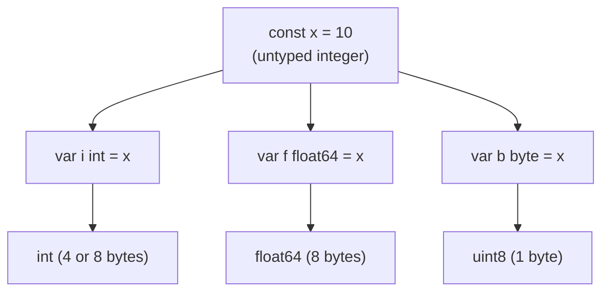
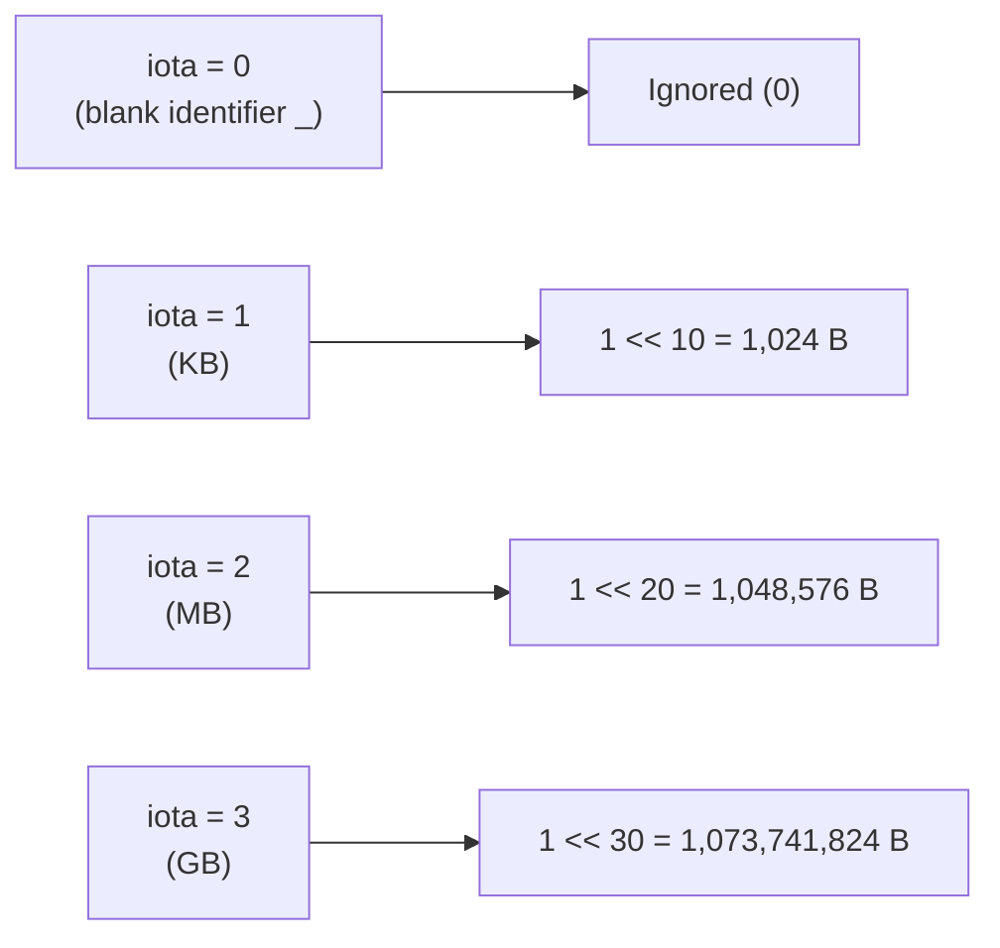

In Go, constants are not merely immutable variables. They are compile-time values evaluated with arbitrary-precision arithmetic, capable of remaining untyped until assigned or used in an expression.

Understanding how the compiler evaluates untyped constants unlocks cleaner APIs, compile-time assertions, and dead-code elimination.

## Untyped Constants and Default Kinds

When declared without an explicit type, a constant in Go is **untyped**. Untyped constants have a default kind (`int`, `rune`, `float64`, `complex128`, `string`, or `bool`) that determines their type when assigned to a variable without explicit type annotations:

```go
const x = 10 // untyped int (default type: int)

var i int = x
var f float64 = x // allowed: 10 represents a valid float64
var b byte = x    // allowed: 10 fits in uint8
```



Untyped constants allow mixing numeric literals without explicit type conversions, provided the values are representable without precision loss:

```go
const a = 1.5 // untyped float
const b = 2   // untyped int

const result = a * b // result is untyped float (3.0)
```

## High-Precision Compile-Time Arithmetic

The Go language specification (§Constants) mandates that numeric constants represent exact values of high precision:

- Integer constants must have **at least 256 bits** of precision.
- Floating-point constants must have **at least 256 bits of mantissa** and a 16-bit signed exponent.

The Go compiler (`gc`) evaluates constant expressions using multi-precision math at compile time. You can compute with numbers that far exceed the limits of `int64` or `float64`:

```go
const (
    // Exact 512-bit intermediate representation at compile time
    largeA = 1 << 100
    largeB = largeA >> 90 // 1 << 10 = 1024
)

var count int = largeB // Valid: 1024 fits in standard int
```

If you attempt to assign `largeA` directly to an `int64`, compilation fails with `constant 1267650600228229401496703205376 overflows int64`.

## Typed Constants and `iota` Bitmasks

The `iota` identifier represents successive untyped integer constants starting at `0` within a constant block. It is especially powerful for declaring bitwise flags and binary byte magnitudes:

```go
type ByteSize uint64

const (
    _           = iota // ignore first value (0)
    KB ByteSize = 1 << (10 * iota) // 1 << 10 = 1024
    MB                             // 1 << 20 = 1048576
    GB                             // 1 << 30 = 1073741824
    TB                             // 1 << 40 = 1099511627776
)
```



## Compile-Time Dead-Code Elimination

Because constant expressions are evaluated during compilation, constant boolean guards in `if` statements allow zero-cost conditional compilation:

```go
const EnableMetrics = false

func RecordMetric(name string, val float64) {
    if !EnableMetrics {
        return // Compiler eliminates all subsequent code in this block
    }
    pushToCollector(name, val)
}
```

When `EnableMetrics` is `false`, the compiler's SSA backend optimizes away the `pushToCollector` call entirely, reducing final binary size and removing branches without runtime overhead.

## Constant Expression Built-Ins

Under the Go specification, only specific built-in functions can be evaluated in constant expressions:

- `len` and `cap` (when applied to strings, arrays, or array pointers)
- `real`, `imag`, and `complex` (for complex numbers)
- `min` and `max` (introduced in Go 1.21, valid when all arguments are constants)
- `unsafe.Sizeof`, `unsafe.Alignof`, and `unsafe.Offsetof`

```go
const bufferLen = 128
const maxCapacity = max(bufferLen, 256) // Compile-time constant (256)
const ptrSize = unsafe.Sizeof(uintptr(0)) // 8 on 64-bit platforms
```

Standard library functions like `math.Sqrt` or `math.Pow` cannot be used in constant declarations because they execute runtime code.

## Language Invariants

1. **Constants have no memory address**: You cannot take the address of a constant (`&x` is invalid). Constants are inlined as literals or registers directly in compiled machine instructions.
2. **Untyped string literals are UTF-8**: String constants represent immutable byte sequences guaranteed to be valid UTF-8 source code representations.
3. **No runtime overhead**: Constant folding and arithmetic evaluation happen entirely during compiler passes, incurring zero CPU cycles at application runtime.
