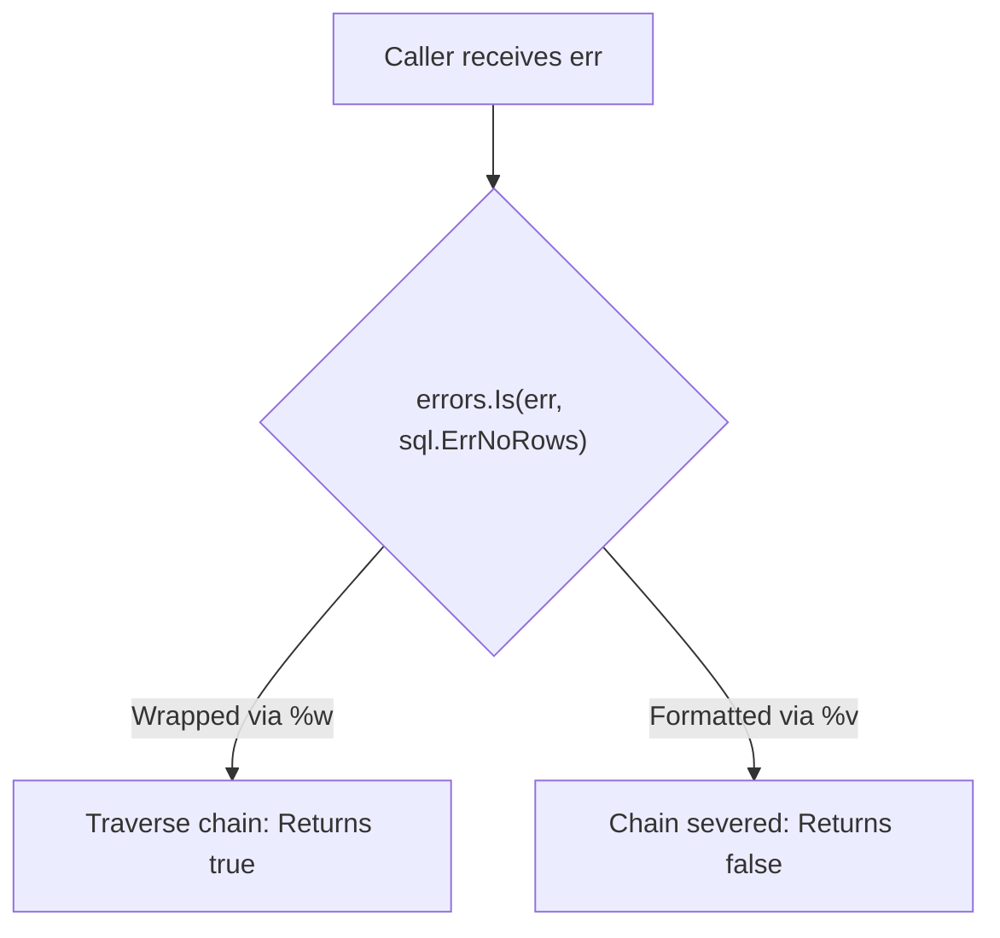
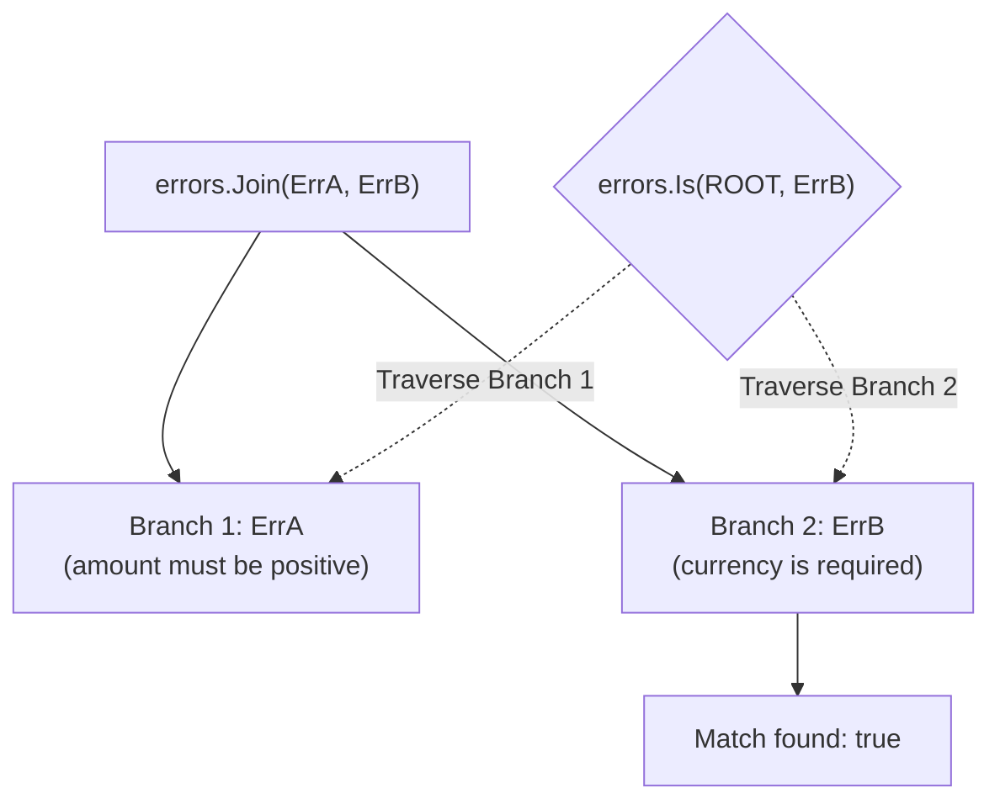

Error wrapping in Go is more than prefixing messages. It defines whether callers can programmatically inspect, match, and unwrap underlying failure modes across package boundaries.

## The Mechanics: `%w` vs `%v`

Using `fmt.Errorf` with `%w` wraps the original error inside an unwrap-capable container struct:

```go
// Wrapped: implements Unwrap() error
return fmt.Errorf("fetching account %s: %w", accountID, err)

// Formatted but not wrapped: breaks Unwrap() chain
return fmt.Errorf("fetching account %s: %v", accountID, err)
```



> [!important]
> `%w` makes the underlying error part of your package's **public contract**. If you wrap an internal database driver error (like `pgx.ErrNoRows` or `sql.ErrConnDone`) with `%w`, callers can bind their logic directly to that internal dependency. If you ever change the storage driver, you break downstream callers. Use `%v` at API boundaries to conceal private implementation details.

## Error Inspection with `errors.Is` and `errors.As`

Go provides two inspection primitives that traverse wrapped error chains:

### 1. `errors.Is` for Value & Sentinel Matching

```go
package main

import (
    "errors"
    "fmt"
    "io"
)

var ErrMalformedPayload = errors.New("malformed ISO 8583 payload")

func parseMessage(r io.Reader) error {
    // ...
    return fmt.Errorf("parsing header: %w", ErrMalformedPayload)
}

func main() {
    err := parseMessage(nil)
    if errors.Is(err, ErrMalformedPayload) {
        fmt.Println("Matched sentinel error across wrapped chain")
    }
}
```

### 2. `errors.As` for Type & Structured Matching

```go
type PaymentDeclineError struct {
    ResponseCode string
    Reason       string
}

func (e *PaymentDeclineError) Error() string {
    return fmt.Sprintf("card declined [%s]: %s", e.ResponseCode, e.Reason)
}

func processAuth() error {
    decline := &PaymentDeclineError{ResponseCode: "51", Reason: "Insufficient funds"}
    return fmt.Errorf("network authorization: %w", decline)
}

func handle() {
    err := processAuth()
    var declineErr *PaymentDeclineError
    if errors.As(err, &declineErr) {
        fmt.Printf("Parsed decline code: %s\n", declineErr.ResponseCode)
    }
}
```

## Multi-Error Wrapping in Go 1.20+

Go 1.20 introduced support for multiple wrapped errors via `errors.Join` and multiple `%w` verbs in `fmt.Errorf`:

```go
func validateTransaction(tx Transaction) error {
    var errs []error
    if tx.Amount <= 0 {
        errs = append(errs, errors.New("amount must be positive"))
    }
    if tx.Currency == "" {
        errs = append(errs, errors.New("currency is required"))
    }
    return errors.Join(errs...)
}
```

When multiple errors are joined, the container implements `Unwrap() []error`. Both `errors.Is` and `errors.As` perform a depth-first search across all branches of the error tree:



## Context Formatting Guidelines

When adding context to an error, answer **"what operation was in flight?"**, not "what went wrong?":

```go
// Bad: Redundant symptom repetition
// Output: "failed: connection timeout: connection timeout"
return fmt.Errorf("failed: %w", err)

// Bad: Generic statement
// Output: "error occurred: EOF"
return fmt.Errorf("error occurred: %w", err)

// Good: Operation intent with domain identifier
// Output: "settling batch B-9912 on card network: unexpected EOF"
return fmt.Errorf("settling batch %s on card network: %w", batchID, err)
```

## Summary Checklist

1. **Use `%w`** when callers need to branch on the underlying sentinel error or extract structured types.
2. **Use `%v`** at public module and service boundaries to avoid leaking internal storage or transport dependencies.
3. **Use `errors.Join`** for parallel tasks or batch validation where all failures should be collected before returning.
4. **Never compare error strings** with `strings.Contains(err.Error(), ...)`: use `errors.Is` or `errors.As`.
