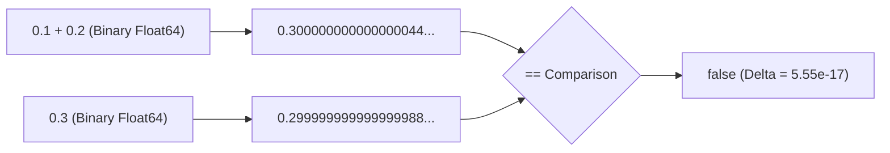

In Go, comparing floating-point numbers (`float32`, `float64`) with `==` in unit tests is a common source of non-deterministic test failures.

Because IEEE-754 floating-point numbers represent values using base-2 fractions ($1/2, 1/4, 1/8, \dots$), common decimal fractions like $0.1$ and $0.2$ cannot be represented exactly in finite binary. They become repeating binary expansions:

$$
0.1_{10} = 0.0001100110011\dots_2
$$

Evaluating `0.1 + 0.2` in 64-bit IEEE-754 yields `0.300000000000000044408920985006...`, while `0.3` is stored as `0.299999999999999988897769753748...`. Direct equality `0.1 + 0.2 == 0.3` evaluates to `false`.



> [!warning]
> Never use floating-point types (`float32` or `float64`) for currency or financial transactions. In financial systems, use integer cents, micros, or fixed-point decimal packages like `shopspring/decimal` to prevent cumulative rounding losses.

## The Flaw of Purely Absolute Tolerance

A naive approach to floating-point assertions is checking whether the absolute difference is below a fixed epsilon:

```go
// Flawed: purely absolute tolerance
func almostEqual(a, b, epsilon float64) bool {
    return math.Abs(a-b) <= epsilon
}
```

This breaks at extreme scales:
1. **For very large numbers** (e.g. $10^{15}$): The spacing between representable `float64` values (the unit in the last place, or ULP) exceeds $10^{-9}$. Even a 1-ULP arithmetic difference will fail an absolute threshold of $10^{-9}$.
2. **For very small numbers** (e.g. $10^{-12}$): Two values like $10^{-12}$ and $2 \times 10^{-12}$ differ by $100\%$, yet their absolute difference is $10^{-12} \le 10^{-9}$, causing the test to incorrectly pass.

## Robust Comparison: Combining Absolute and Relative Tolerances

A robust floating-point comparison combines an absolute epsilon (for values near zero) with a relative tolerance (for scaled magnitudes):

$$
|a - b| \le \max\left(\varepsilon_{\text{abs}},\ \varepsilon_{\text{rel}} \cdot \max(|a|,\ |b|)\right)
$$

Here is an allocation-free Go implementation handling `NaN`, infinities, and signed zeros:

```go
package floatcheck

import "math"

const (
    DefaultAbsTolerance = 1e-9
    DefaultRelTolerance = 1e-7
)

// InDelta asserts that a and b are within combined relative and absolute bounds
func InDelta(a, b, absTol, relTol float64) bool {
    if a == b {
        return true
    }
    if math.IsNaN(a) || math.IsNaN(b) {
        return false
    }
    if math.IsInf(a, 0) || math.IsInf(b, 0) {
        return a == b
    }

    diff := math.Abs(a - b)
    if diff <= absTol {
        return true
    }

    maxVal := math.Max(math.Abs(a), math.Abs(b))
    return diff <= relTol*maxVal
}
```

## Testing with `google/go-cmp`

In production test suites, avoid writing ad-hoc float equality assertions inside every test loop. Use `google/go-cmp` with `cmpopts.EquateApprox`:

```go
package service_test

import (
    "testing"

    "github.com/google/go-cmp/cmp"
    "github.com/google/go-cmp/cmp/cmpopts"
)

type SensorReading struct {
    Latitude  float64
    Longitude float64
    Altitude  float64
}

func TestSensorCalibration(t *testing.T) {
    got := CalculatePosition(120.4, 45.2)
    want := SensorReading{
        Latitude:  37.774929,
        Longitude: -122.419416,
        Altitude:  14.25,
    }

    // EquateApprox(fraction, margin) checks:
    // |got - want| <= max(margin, fraction * min(|got|, |want|))
    opt := cmpopts.EquateApprox(1e-6, 1e-9)

    if diff := cmp.Diff(want, got, opt); diff != "" {
        t.Errorf("CalculatePosition() mismatch (-want +got):\n%s", diff)
    }
}
```

## When Direct Equality Is Safe

Direct comparison (`a == b`) is safe in Go only when:
- Checking against exact bitwise constants without intervening arithmetic (e.g. `val == 0.0` or checking sentinel constants).
- Checking IEEE special values using standard library guards: `math.IsNaN(x)` or `math.IsInf(x, sign)`.
- Replaying identical, deterministic bitwise values copied directly without cross-platform FMA (fused multiply-add) instruction variance.
