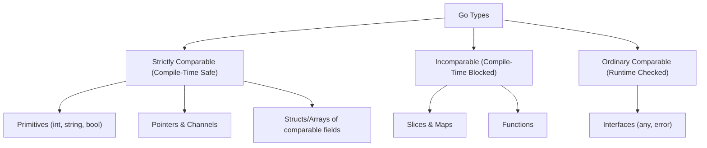
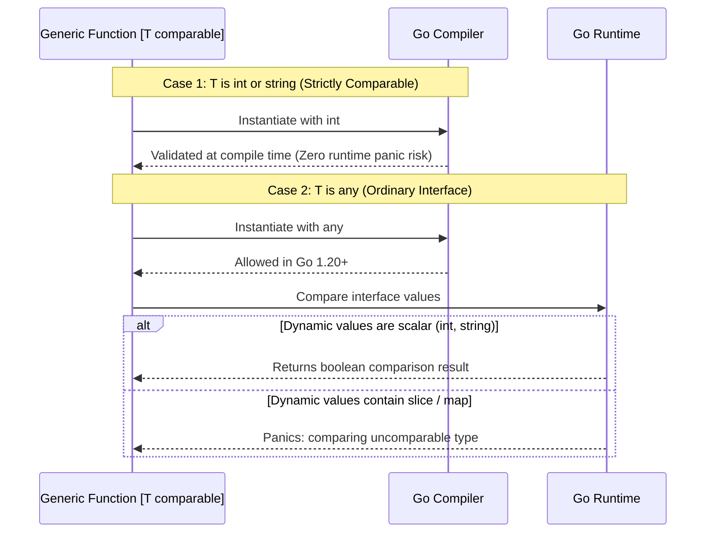

In Go's type parameter system, `comparable` is a predefined constraint implemented by every type that supports equality comparisons using `==` and `!=`.

Without `comparable`, generic code cannot use equality operators or instantiate `map` keys with type parameters.

## Which Types Are Comparable?

Under the Go language specification (§Comparison operators), the following types are strictly comparable:

- **Booleans and numeric types**: `bool`, `int`, `int64`, `float64`, `complex128`, and related primitives
- **Strings**: Compared byte-for-byte
- **Pointers**: Compared by memory address
- **Channels**: Compared by runtime channel pointer identity
- **Structs**: Comparable if and only if every field in the struct is comparable
- **Arrays**: Comparable if and only if the element type is comparable
- **Interfaces**: Comparable if their dynamic types support equality (with runtime caveats)

Slices, maps, and functions are **not** comparable. Any struct or array containing a slice, map, or function is also not comparable.



## Generic Sets and Slice Lookups

The primary use case for `comparable` is creating generic collections, deduplication pipelines, and lookups:

```go
package main

import "fmt"

// Set is a generic hash set requiring comparable elements for map keys
type Set[T comparable] struct {
    elements map[T]struct{}
}

func NewSet[T comparable]() *Set[T] {
    return &Set[T]{elements: make(map[T]struct{})}
}

func (s *Set[T]) Add(val T) {
    s.elements[val] = struct{}{}
}

func (s *Set[T]) Contains(val T) bool {
    _, ok := s.elements[val]
    return ok
}

// RemoveDuplicates filters out repeated items while preserving initial order
func RemoveDuplicates[T comparable](items []T) []T {
    seen := make(map[T]struct{}, len(items))
    result := make([]T, 0, len(items))
    for _, item := range items {
        if _, exists := seen[item]; !exists {
            seen[item] = struct{}{}
            result = append(result, item)
        }
    }
    return result
}
```

## The Go 1.20 Interface Comparability Evolution

In Go 1.18 and 1.19, interface types (like `any` or `error`) could not satisfy the `comparable` constraint. If you attempted to instantiate `NewSet[any]()`, the compiler failed: `any does not implement comparable`.

This restriction existed because interface comparison in Go is dynamic: comparing two interface values whose underlying concrete types are slices or maps causes a **runtime panic**:

```go
var a, b any = []int{1}, []int{2}
fmt.Println(a == b) // runtime panic: comparing uncomparable type []int
```

In Go 1.20 (proposals #51338 and #56548), the language authors relaxed this constraint:

1. **Ordinary comparability**: Non-type-parameter interface types (like `any`, `fmt.Stringer`, or custom interfaces) now satisfy `comparable` constraints.
2. **Strict comparability**: Concrete types without interfaces guarantee compile-time safety without the risk of dynamic comparison panics.



## Summary of Constraints

| Constraint | Allowed Types | Supported Operations |
|---|---|---|
| `any` | All Go types | Assignment, type assertions, passing to functions |
| `comparable` | Primitives, pointers, channels, interfaces, comparable structs/arrays | `==`, `!=`, and map key usage |
| `cmp.Ordered` | Integers, floats, strings | `<`, `<=`, `>`, `>=`, `==`, `!=` |

When authoring generic packages, use `comparable` whenever your algorithms rely on equality checks or map key lookups. If ordering is required, prefer the standard library `cmp.Ordered` constraint.
