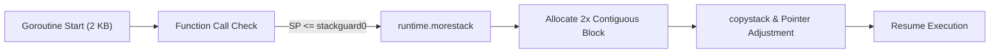
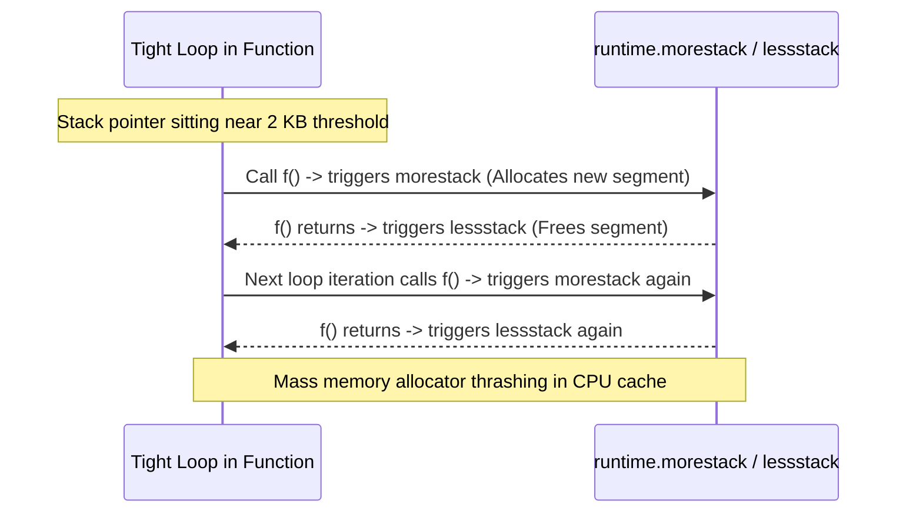
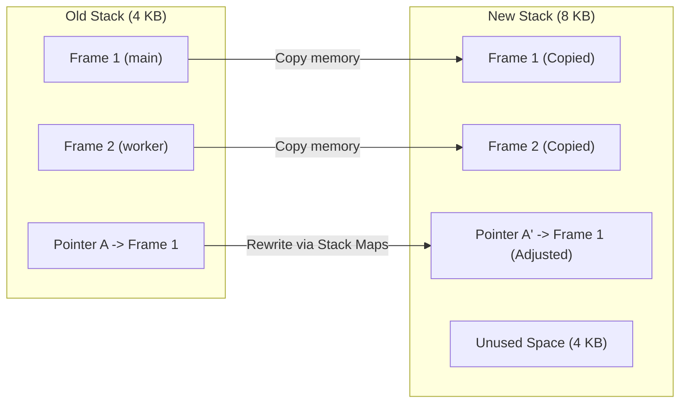

Standard operating system threads typically allocate a fixed 1MB to 8MB stack upfront with guard pages. Spawning 100,000 OS threads would consume hundreds of gigabytes of virtual memory.

Go achieves its high concurrency concurrency model by initializing goroutines with a **2 KB stack** and dynamically growing and shrinking memory in response to runtime call depth.



## The Historical Problem: Segmented Stacks and the "Hot Split"

In Go 1.0 through 1.3, Go used **segmented stacks** (split stacks). When a function needed more stack space than remained in its current 2KB block, the runtime allocated a new heap segment and linked it via a pointer list.

This created a severe performance failure mode known as the **hot split problem**:



If a loop executed near the 2KB stack boundary and called a function, every iteration triggered a dynamic allocation and deallocation cycle.

## The Modern Solution: Contiguous Stacks (Go 1.4+)

In Go 1.4, the Go team replaced segmented stacks with **contiguous stack reallocation**:

1. When a goroutine outgrows its current stack, the runtime allocates a new contiguous memory buffer of **double the size** (e.g. 2KB $\to$ 4KB $\to$ 8KB $\to$ 16KB).
2. The runtime invokes `runtime.copystack`, copying all active stack frames from the old buffer to the new buffer.
3. **Pointer Relocation with Stack Maps**: The compiler generates static *stack maps* that tell the garbage collector and runtime exactly which 8-byte words on the stack are pointers. The runtime updates every internal pointer to point to the relocated frame addresses in the new memory block.
4. The old stack buffer is released to the runtime mcache pool.



## The Compiler's Stack Check Prologue

To determine when a stack copy is required without kernel traps, the Go compiler inserts a 3-instruction assembly prologue at the head of every non-leaf function:

```assembly
// Go compiler prologue (x86-64)
MOVQ (TLS), CX           // Load current Goroutine (g) pointer
CMPQ SP, 16(CX)          // Compare SP with g.stackguard0
JBE  runtime.morestack_noctxt // Jump if stack pointer is dangerously low
```

If the remaining stack space falls below `g.stackguard0`, execution branches to `runtime.morestack`, triggering contiguous expansion.

## Stack Shrinking During Garbage Collection

Stack memory does not grow unbounded during spikes. During the concurrent mark phase of Garbage Collection:

- If a goroutine is using **less than 1/4 of its allocated stack capacity**, the runtime allocates a buffer half the current size and copies the frames over.
- The stack will not shrink below the initial 2 KB floor.

## Stack Limits & `debug.SetMaxStack`

By default, the runtime enforces a stack ceiling of **1 GB** on 64-bit platforms (250 MB on 32-bit platforms) to prevent accidental infinite recursion from consuming entire machine RAM.

You can configure this ceiling programmatically using standard library `runtime/debug`:

```go
package main

import (
    "runtime/debug"
)

func init() {
    // Restrict runaway recursion in high-density worker pools to 20MB
    debug.SetMaxStack(20 * 1024 * 1024)
}
```

## Engineering Rules

1. **Avoid deeply nested goroutine recursion**: While stacks grow dynamically, large stacks hold many object references, increasing GC mark phase scan times.
2. **Value semantics on stack**: Keeping structs on the stack eliminates heap escape and garbage collection pressure entirely.
3. **Understand copy overhead**: Heavy stack growth causes `runtime.copystack` execution. For high-throughput worker routines, keeping call chains bounded prevents reallocation jitter.
