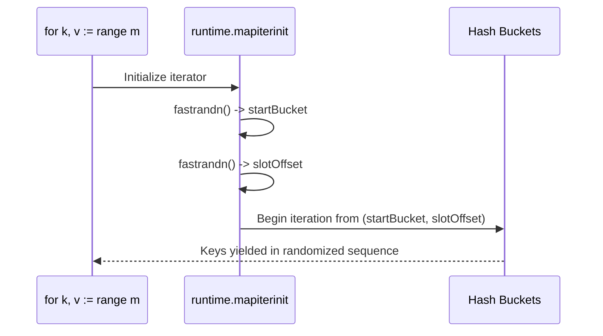
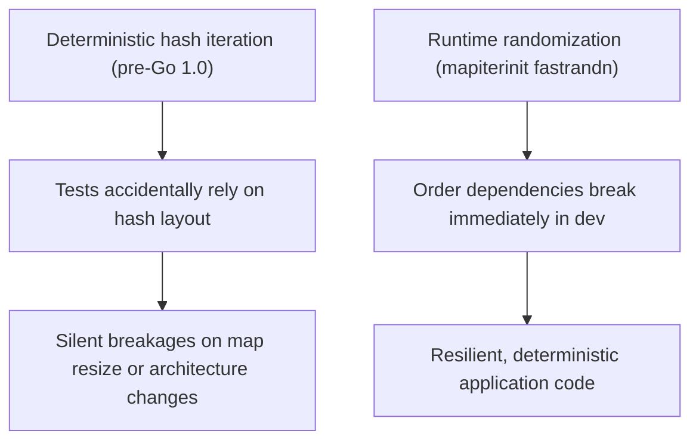

The Go language specification is explicit about map iteration:

> The iteration order over maps is not specified and is not guaranteed to be the same from one iteration to the next.

This is not just a disclaimer in the specification. The Go runtime actively enforces non-deterministic iteration to prevent programs from depending on hash table layout.

## The Deliberate Randomization in `mapiterinit`

When you write `for k, v := range m`, the compiler lowers this to a call to `runtime.mapiterinit`. Inside the runtime, Go picks a randomized starting bucket and a randomized slot offset within that bucket:

```go
// From Go runtime/map.go (traditional map implementation):
func mapiterinit(t *maptype, h *hmap, it *hiter) {
    // ...
    // decide where to start
    r := uintptr(fastrandn(uint32(1 << h.B)))
    it.startBucket = r
    it.offset = uint8(fastrandn(abi.MapBucketCount))
    // ...
}
```



Because `fastrandn` produces a new starting point on every loop invocation, two consecutive `for ... range` loops over the exact same map in the same process can yield keys in completely different sequences.

In modern Go runtimes using Swiss Tables, the same principle holds: the iterator seeds a random group and slot offset before probing control bytes.

## Why the Runtime Does This

Before Go 1.0, map iteration walked buckets sequentially from bucket 0. The order was not technically guaranteed, but it was deterministic for identical insertion patterns.

This created a widespread failure mode: developers wrote unit tests that accidentally relied on hash layout order. When the hash seed changed, when map capacity resized, or when code ran on a different CPU architecture, tests failed unpredictably across environments.

The Go authors added deliberate iteration randomization so that code depending on map order fails immediately and visibly in local development rather than in production.



## How to Iterate Deterministically

When you require stable iteration (for example, generating JSON payloads, writing deterministic serialization formats, or creating reproducible test assertions), extract the keys, sort them, and iterate over the sorted slice:

```go
package main

import (
    "fmt"
    "slices"
)

func main() {
    counts := map[string]int{
        "amber":  12,
        "cobalt": 4,
        "bronze": 9,
        "zinc":   1,
    }

    // Allocate exact capacity to avoid slice reallocation
    keys := make([]string, 0, len(counts))
    for k := range counts {
        keys = append(keys, k)
    }

    // Sort keys in place with slices.Sort
    slices.Sort(keys)

    for _, k := range keys {
        fmt.Printf("%s: %d\n", k, counts[k])
    }
}
```

In Go 1.23 and later, you can also collect keys using the standard `maps.Keys` iterator helper:

```go
keys := slices.Collect(maps.Keys(counts))
slices.Sort(keys)
```

## Implementation Rules

1. **Never assert on map output directly in tests**: Comparing `fmt.Sprint(m)` against an expected string will produce flaky tests. Use `reflect.DeepEqual` or `google/go-cmp` for map equality.
2. **Pre-allocate key slices**: When collecting map keys for sorting, pass `len(m)` as slice capacity (`make([]K, 0, len(m))`) to eliminate heap reallocations during collection.
3. **Map hashing is per-process seeded**: The runtime initializes a global hash seed at startup via AES-NI / hardware entropy. You cannot reproduce map hash distributions across separate program runs.
