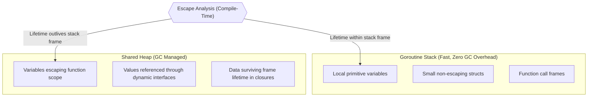
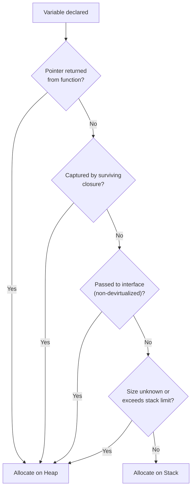

Memory management in Go balances the developer ergonomics of garbage collection with the performance of low-level pointer arithmetic and stack allocation.

Understanding how the compiler chooses between stack and heap allocation is essential for authoring high-throughput, low-latency Go services.

## Stack vs Heap: The Hardware Reality

Every goroutine maintains its own contiguous stack that grows and shrinks dynamically. Stack allocations are essentially free: reclaiming memory requires only decrementing the stack pointer register (`SP`).

The shared heap, managed by the Go runtime allocator (based on TCMalloc thread-caching) and concurrent tri-color mark-sweep garbage collector, requires synchronization, pointer tracking, and periodic GC scanning pauses.



## Value Semantics vs Pointer Overhead

A common misconception among developers transitioning from C++ is that passing pointers is always faster because it avoids copying data.

On modern 64-bit architectures, Go uses a **register-based calling convention** (Go 1.17+ ABIInternal). Small structs (such as `time.Time`, UUIDs, or records with 2 to 4 fields) fit entirely within CPU registers (`RAX`, `RBX`, `RCX`, etc.) and are passed with zero memory reads or writes.

```go
type Point struct {
    X, Y float64
}

// Passed directly in CPU floating point registers (Zero memory allocation)
func Distance(p1, p2 Point) float64 {
    dx := p1.X - p2.X
    dy := p1.Y - p2.Y
    return math.Sqrt(dx*dx + dy*dy)
}

// Forces pointer indirection and potential heap escape if returned
func DistancePtr(p1, p2 *Point) float64 {
    dx := p1.X - p2.X
    dy := p1.Y - p2.Y
    return math.Sqrt(dx*dx + dy*dy)
}
```

Passing pointers to small structs introduces pointer indirection (cache misses) and may force the struct to escape to the heap, creating garbage collection overhead.

### When to Use Pointers
1. **Mutation**: When a method or function must modify the caller's receiver state.
2. **Large structs**: When copying the struct payload exceeds CPU cache line efficiency ($> 64-128$ bytes).
3. **Consistency**: If some methods on a type require pointer receivers for mutation, use pointer receivers across all methods to maintain interface consistency.

## Escape Analysis Mechanics

Escape analysis is a compile-time optimization pass that determines whether an allocation can be safely placed on the stack or must escape to the heap:



Inspect escape analysis decisions on any Go package with compiler flags:

```bash
go build -gcflags="-m -m" main.go
```

Example compiler diagnostic output:

```
./main.go:12:13: p escapes to heap:
./main.go:12:13:   flow: ~r0 = &p:
./main.go:12:13:     from return &p (return) at ./main.go:12:5
./main.go:10:2: moved to heap: p
```

## Concurrency: Shared Pointers and Race Conditions

When multiple goroutines access a shared memory pointer without synchronization, a data race occurs.

```go
package main

import (
    "fmt"
    "sync"
    "sync/atomic"
)

func main() {
    var wg sync.WaitGroup
    var counter atomic.Int64 // Lock-free atomic counter

    for i := 0; i < 1000; i++ {
        wg.Add(1)
        go func() {
            defer wg.Done()
            counter.Add(1) // Atomic hardware CAS instruction
        }()
    }

    wg.Wait()
    fmt.Printf("Final count: %d\n", counter.Load())
}
```

Always execute test suites with the race detector enabled to verify memory safety:

```bash
go test -race ./...
```

## Architectural Guidelines

1. **Default to value semantics**: For small, immutable domain types, prefer values over pointers to maximize CPU register utilization and eliminate heap allocations.
2. **Beware of interface boxing**: Passing concrete types to `any` or formatting functions like `fmt.Println` often forces values to escape to the heap unless devirtualized by the compiler.
3. **Use atomic primitives for shared counters**: Prefer `sync/atomic` types (`atomic.Int64`, `atomic.Pointer`) over mutexes for single-word synchronized mutations.
