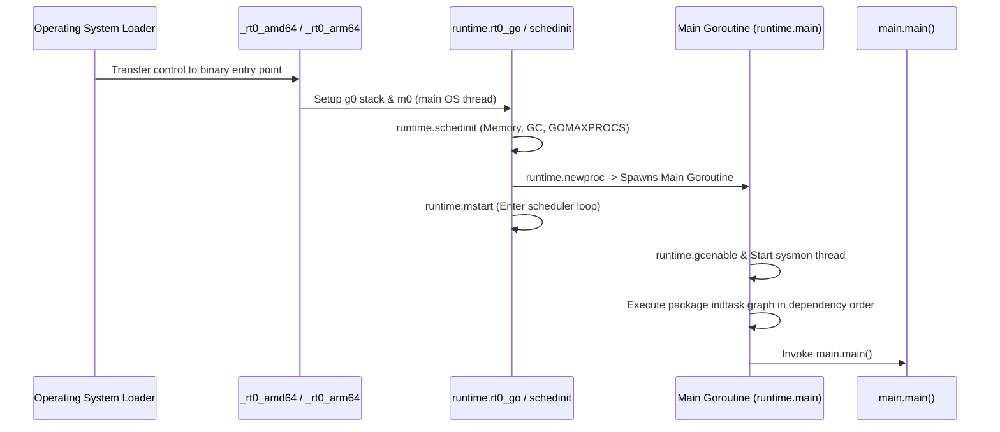
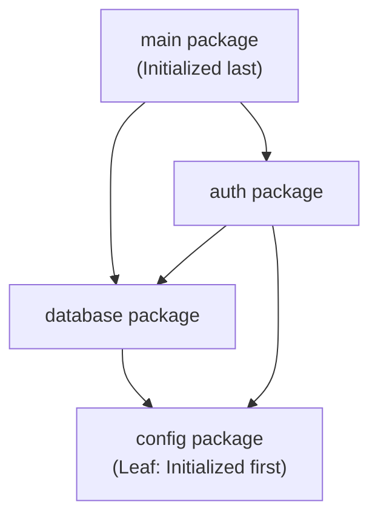
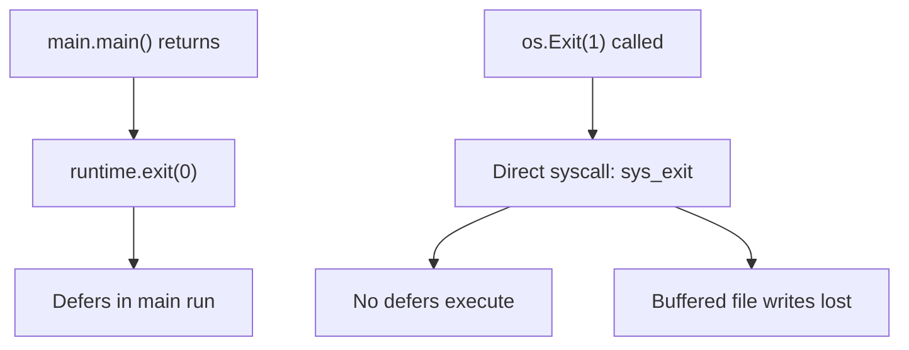

Before the first line of your `main.main()` function executes, the Go runtime performs a multi-stage bootstrap sequence: detecting CPU hardware capabilities, setting up memory allocators, initializing logical processors, and executing package initializations in topological dependency order.

## The Bootstrap Execution Chain

When an operating system loads a compiled Go ELF or Mach-O binary, execution starts at the architecture-specific assembly entry point:



### Stage 1: CPU Detection and Machine Initialization (`runtime.rt0_go`)
The assembly bootstrap reads `argc` and `argv`, sets up the thread-local storage (`TLS`), determines hardware feature flags (such as AES-NI, AVX-512, or ARM NEON), and links the bootstrap OS thread (`m0`) with the system execution stack (`g0`).

### Stage 2: Subsystem Allocation (`runtime.schedinit`)
`schedinit` initializes all core runtime engines:
- **Memory Allocator** (`mallocinit`): Configures heap spans and thread caches (`mcache`).
- **Garbage Collector** (`gcinit`): Calculates heap pacing parameters and pacing targets.
- **Processors** (`procresize`): Allocates $P$ logical processors matching `GOMAXPROCS`.
- **System Stack**: Initializes stack pools and signal preemption handlers.

### Stage 3: The Main Goroutine (`runtime.main`)
Once the scheduler starts via `runtime.mstart`, the runtime spawns the first official user goroutine executing `runtime.main`. This goroutine starts the background `sysmon` thread, enables garbage collection (`gcenable`), and evaluates the compiler-generated package dependency graph.

## Package Initialization Order (`inittask`)

Go initializes packages strictly in **topological dependency order** (leaf dependencies first). Circular imports are rejected at compile time.



1. **Variables before `init()`**: Within a package, package-level variables are initialized first (evaluating expressions and dependencies).
2. **Lexical order across files**: If a package spans multiple source files, files are processed in **lexical (alphabetical) base name order** as presented to the compiler.
3. **Multiple `init()` functions**: A package can define multiple `init()` functions across several files. They execute sequentially in lexical file order and source code line order.

## Exit Behavior: `return` vs `os.Exit()`

The way a Go application terminates determines whether runtime cleanup occurs:



```go
package main

import (
    "fmt"
    "os"
)

func main() {
    defer fmt.Println("Deferred cleanup executed")

    if err := run(); err != nil {
        fmt.Fprintf(os.Stderr, "Fatal error: %v\n", err)
        os.Exit(1) // Bypasses the deferred cleanup above!
    }
}
```

To ensure `defer` statements execute on error paths, structure `main` to return an exit code to a thin runner rather than calling `os.Exit` deep in your application logic.

## Runtime Invariants

1. **`init()` cannot be called manually**: `init` functions have no identifier in package scope and cannot be referenced or invoked by application code.
2. **Main goroutine lock**: The main goroutine is not pinned to `m0` unless explicitly locked with `runtime.LockOSThread()`.
3. **Program termination**: When `main.main()` returns, the runtime immediately terminates the process, even if background goroutines are actively running. Use `sync.WaitGroup` or context cancellation to manage graceful shutdown.
