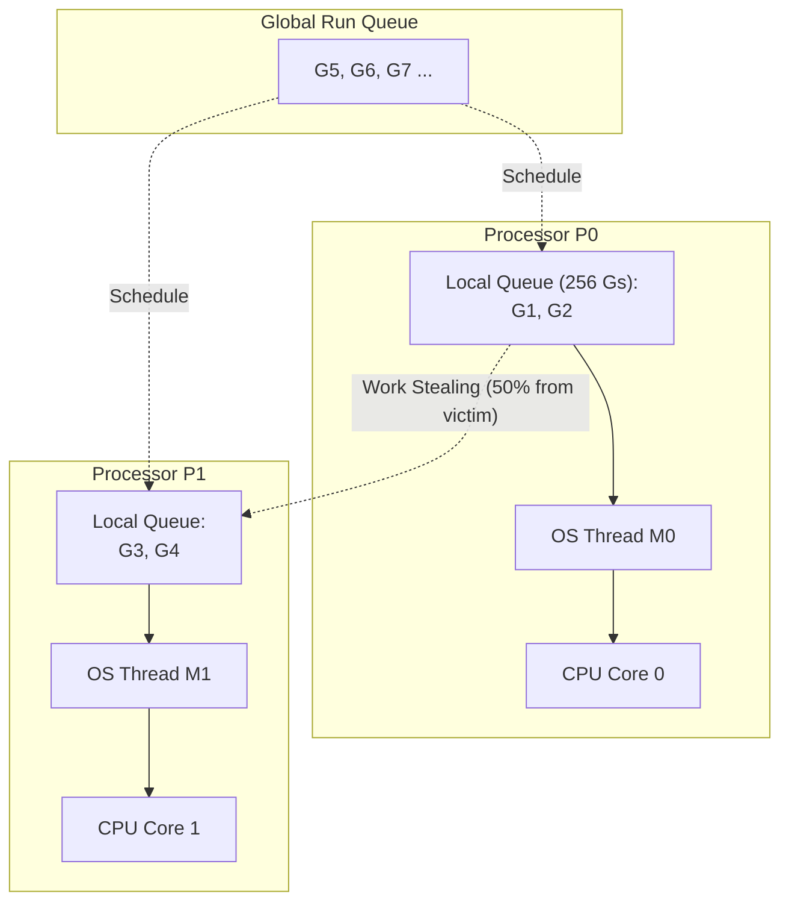
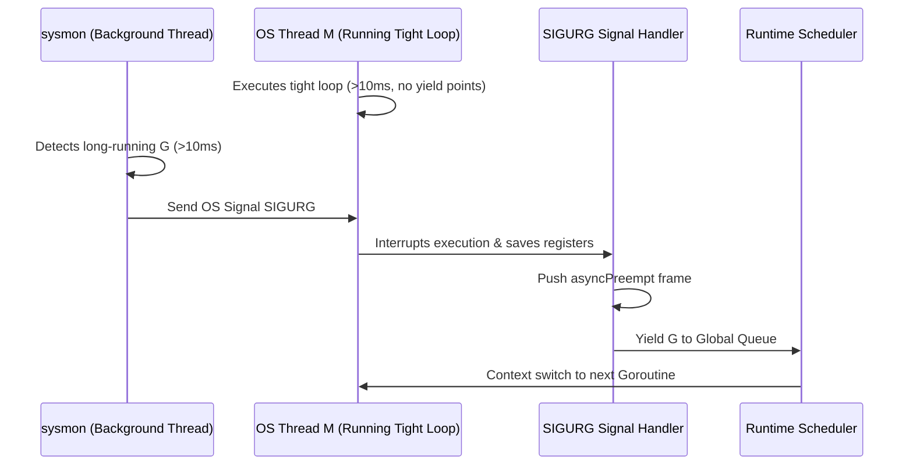

The Go runtime multiplexes $M$ goroutines over $N$ operating system threads using the **GMP scheduler**:

- **G (Goroutine)**: Represents the goroutine stack, instruction pointer, and scheduling state.
- **M (Machine)**: Represents an actual OS thread created by the kernel.
- **P (Processor)**: Represents a logical resource context required to execute Go code (defaulting to `runtime.GOMAXPROCS(0)`).

Each P owns a local run queue (capacity 256 Gs), while the runtime maintains a shared global run queue.



## Cooperative Yield Points

Historically, Go was a strictly **cooperative scheduler**. A running goroutine yielded execution to other goroutines only at explicit yield points:

1. **Channel operations**: Sending or receiving on a channel (`ch <- val`, `<-ch`).
2. **Network I/O**: Blocking network calls routed through the epoll/kqueue `netpoller`.
3. **Synchronization**: Locking a `sync.Mutex` or parking on a `sync.WaitGroup`.
4. **System calls**: Entering blocking file or OS syscalls.
5. **Stack checks**: Calling any non-inlined function where the compiler inserted a stack check prologue.
6. **Explicit yields**: Invoking `runtime.Gosched()`.

## The Pre-Go 1.14 Trap: Tight Loop Deadlocks

Before Go 1.14, a tight CPU-bound computation loop with no function calls had zero yield points:

```go
// Pre-Go 1.14: Monopolized the processor indefinitely
go func() {
    for {
        // Tight loop with no function calls or channel I/O
    }
}()
```

If `GOMAXPROCS` was 1, this loop starved all other goroutines. More critically, when the Garbage Collector attempted a Stop-The-World (STW) pause, it had to wait for all P processors to reach a safepoint. Because the tight loop never hit a safepoint, the entire application **deadlocked permanently**.

## Modern Asynchronous Preemption (Go 1.14+)

In Go 1.14, the runtime introduced **asynchronous preemption** driven by OS signals:

1. The runtime runs a background monitoring thread called `sysmon` (which executes without a P).
2. `sysmon` inspects all active goroutines. If a goroutine has run on a P for more than **10 milliseconds** without yielding, `sysmon` emits a `SIGURG` signal (on Unix platforms) or calls `SuspendThread` (on Windows) targeting the underlying OS thread (M).
3. The OS thread catches the signal. The runtime signal handler checks whether the current instruction is at a safe register state.
4. If safe, the signal handler saves the goroutine's registers, pushes a call to `runtime.asyncPreempt`, moves the G back to the global run queue, and invokes the scheduler to run the next runnable G.



## Where Preemption Still Cannot Occur

While Go 1.14+ handles almost all tight loops, certain regions remain non-preemptible:

1. **Assembly functions without stack maps**: Hand-written assembly routines without safepoint annotations cannot be safely interrupted because the garbage collector cannot trace pointer registers.
2. **Cgo calls**: While executing C code inside cgo, execution is outside the Go runtime; `sysmon` cannot preempt until execution returns across the cgo boundary.
3. **Runtime internal locks**: Goroutines executing low-level runtime code while holding internal locks (e.g. `gopark` or malloc locks) defer signal preemption until the lock is released.

## Practical Concurrency Patterns

```go
package main

import (
    "context"
    "runtime"
)

// ComputeWorker demonstrates cooperative yielding in long-running CPU calculations
func ComputeWorker(ctx context.Context, data []float64) {
    for i, val := range data {
        // Check cancellation every batch
        if i%1000 == 0 {
            select {
            case <-ctx.Done():
                return
            default:
                // Voluntarily yield execution in tight batch loops
                runtime.Gosched()
            }
        }
        process(val)
    }
}
```

## Scheduler Rules

1. **Do not use busy-spin loops**: Never use `for !ready {}` to wait for state changes. Use `sync.Cond`, channels, or `sync/atomic` with event notifications.
2. **Work-stealing mechanics**: When a P exhausts its local queue, it steals half of the runnable goroutines from another randomly chosen P to balance CPU core utilization.
3. **I/O scalability**: Go handles hundreds of thousands of network connections because `netpoller` parks goroutines without blocking kernel threads.
