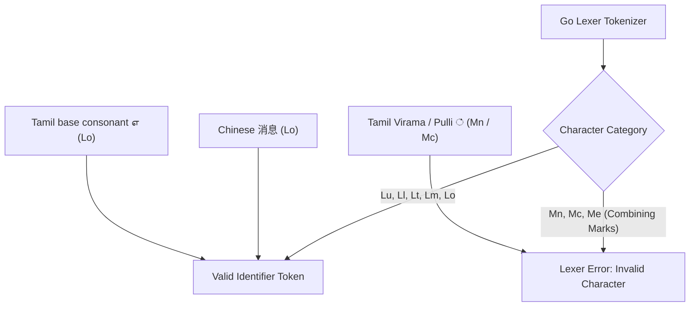

Go source files are UTF-8 encoded by definition, and the language allows Unicode characters in variable, type, and function names.

However, while standalone ideographic scripts (like Chinese or Japanese Hanzi/Kanji) compile without issues, abugida scripts (including Tamil, Hindi, Telugu, and Thai) trigger compiler errors when writing natural words.

```go
package main

import "fmt"

func main() {
    // Compiles cleanly: Chinese Hanzi belongs to category Lo (Letter, Other)
    消息 := "Hello, World!"
    fmt.Println(消息)

    // Fails to compile: Tamil syllable contains combining mark U+0BCD
    // ./main.go:10:5: invalid character U+0BCD '்' in identifier
    எண்ணிக்கை := 42
    fmt.Println(எண்ணிக்கை)
}
```

## Go Spec §Identifiers vs Unicode General Categories

The Go language specification (§Identifiers) strictly defines valid identifier characters using Unicode General Categories:

```
identifier     = letter { letter | unicode_digit } .
letter         = unicode_letter | "_" .
unicode_letter = /* a Unicode code point categorized as Lu, Ll, Lt, Lm, or Lo */ .
```

The allowed categories are:
- `Lu`: Uppercase Letter (e.g. Latin, Greek, Cyrillic)
- `Ll`: Lowercase Letter
- `Lt`: Titlecase Letter
- `Lm`: Modifier Letter
- `Lo`: Other Letter (e.g. Chinese `消`, Tamil base consonant `எ`)



## Why Abugida Scripts Fail in Go

Tamil is an abugida script. Vowelized consonants are composed of a base consonant followed by a combining vowel sign or virama (pulli):

- In `"எண்ணிக்கை"`, the base character `"ண"` (`U+0BA3`) is categorized as `Lo` (valid letter).
- The virama `"்"` (`U+0BCD`) is categorized as `Mn` (Nonspacing Mark).

Because the Go specification excludes all combining marks (`Mn`, `Mc`, and `Me`) from the definition of `unicode_letter`, any word containing a diacritic or combining mark is rejected at tokenization time.

## Go Spec vs Unicode UAX #31

Modern programming languages (such as Rust, Swift, and Python 3) implement **Unicode Standard Annex #31** (UAX #31: Identifier and Pattern Syntax):

$$
\text{Identifier} = \text{XID\_Start} + \text{XID\_Continue}^*
$$

Under UAX #31:
- `XID_Start` permits initial letters (`L*`, `Nl`).
- `XID_Continue` permits continuation letters, digits, and critically **combining marks** (`Mn`, `Mc`).

Go intentionally chose a simpler, static character-class filter over full UAX #31 parsing to keep the compiler lexer fast, predictable, and free of complex Unicode normalization lookahead passes.

## The Exportability Invariant

Even for scripts that compile cleanly (such as Chinese), Go enforces an exportability rule based on Unicode casing:

> An identifier is exported if the first character of the identifier's name is a Unicode uppercase letter (category Lu).

Because non-cased writing systems (Chinese, Japanese, Arabic, Hebrew, Devanagari, Tamil) belong exclusively to category `Lo` ("Letter, Other"), `unicode.IsUpper()` returns `false` for every character.

```go
package ledger

// Private to package ledger: 交易 is category Lo, not Lu (cannot be exported)
type 交易 struct {
    Amount int64
}
```

In Go, **all non-cased Unicode identifiers are permanently unexported (package-private)**. To export a symbol across package boundaries, the identifier must begin with an ASCII or cased Latin/Cyrillic/Greek uppercase letter (`A-Z`).

## Architectural Takeaways

1. **Use ASCII for public APIs and identifiers**: Restricting identifiers to ASCII guarantees compatibility across international developer teams, CLI tooling, and debugger symbol tables.
2. **UTF-8 in string literals and comments**: Go provides full Unicode support in string values, raw bytes, and documentation comments where combining marks and ZWJ sequences are fully valid.
3. **Lexer speed over UAX #31**: Go's identifier rules reflect a deliberate design trade-off prioritizing sub-second compiler compilation speeds over complex Unicode normalization.
