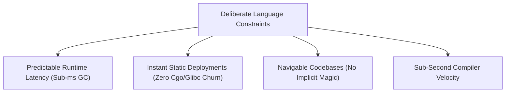
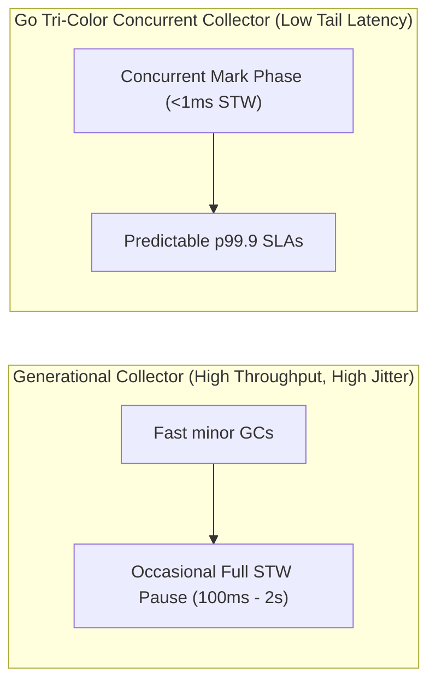
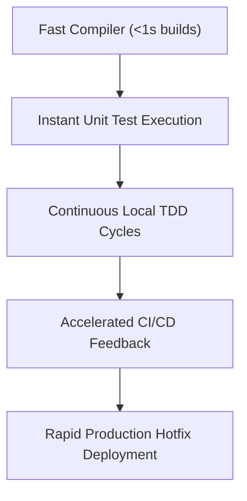

Discussions around Go often contrast its syntactic simplicity with the expressive type systems of Rust, Haskell, or modern C++. Critics frequently cite the absence of algebraic data types, operator overloading, and macro meta-programming as deficits.

In production backend infrastructure and payment gateways, these omissions are not oversights. They are deliberate design choices that trade language cleverness for operational predictability, maintainability across large engineering teams, and sub-second developer feedback loops.



## 1. Operational Predictability and Sub-Millisecond GC

For high-throughput financial and distributed services, p99.9 latency matters more than peak synthetic throughput.

Many high-performance runtimes historically relied on generational garbage collectors that required complex tuning knobs (eden spaces, survivor ratios, tenured generation sizing) and suffered from occasional multi-second Stop-The-World (STW) pauses.

Go made a deliberate architectural trade-off:
- The Go garbage collector (pioneered by Rick Hudson) is a concurrent, tri-color mark-sweep collector optimized specifically for **sub-millisecond STW pause times** (typically under 500 microseconds).
- Instead of maximizing batch throughput at the cost of latency variance, Go prioritizes predictable, uniform request handling.



## 2. The Single Static Binary Model

Deploying services in containerized cloud environments reveals the fragility of dynamic linking. Version mismatches between `glibc` on build machines and target container base images are a persistent source of production downtime.

Go compiles to a single, self-contained static binary (`CGO_ENABLED=0`):
- Containers run on scratch or minimal distroless base images with zero system dependencies.
- Cold start times are measured in single-digit milliseconds rather than seconds.
- Attack surfaces are drastically reduced because the container filesystem contains only the executable binary.

## 3. Readability and Maintenance at Scale

In large organizations with hundreds or thousands of engineers, code is read orders of magnitude more often than it is written.

Languages with heavy metaprogramming (macros, runtime reflection magic, aspect-oriented annotations, operator overloading) allow individual developers to construct private domain-specific dialects. While expressive for the author, it forces every subsequent maintainer to decipher hidden execution paths:

```go
// In Go, control flow is strictly explicit:
result, err := accountService.Debit(ctx, req)
if err != nil {
    return fmt.Errorf("debit failed: %w", err)
}
```

There are no hidden exception handlers, no implicit aspect interceptors injected by reflection frameworks, and no invisible type conversions. What you read in the source code is precisely what the CPU executes.

## 4. Compiler Velocity as an Engineering Asset

Compilation speed is a first-class language feature. The Go compiler (`gc`) was designed from inception to compile hundreds of thousands of lines of code per second.



When CI pipelines complete test and build suites in 15 seconds rather than 15 minutes, developer iteration cycles accelerate, and production incident remediation times drop dramatically.

## 5. Intentional Constraints

When Go introduced generics in version 1.18, it did so with strict conservative boundaries: type parameters without template specialization or metaprogramming recursion. This preserved Go's fast compilation and monomorphized efficiency without code bloat.

Similarly, explicit error handling (`if err != nil`) forces engineers to actively structure failure paths directly alongside the happy path, eliminating unhandled runtime exceptions.

## Summary

Go is not intended for every computational domain: it is not a systems kernel language like C, nor does it attempt the compile-time theorem proving of Rust.

For backend microservices, payment pipelines, and cloud-native distributed systems, Go provides an optimal balance: brutal simplicity, instant deployments, and predictable latency.
