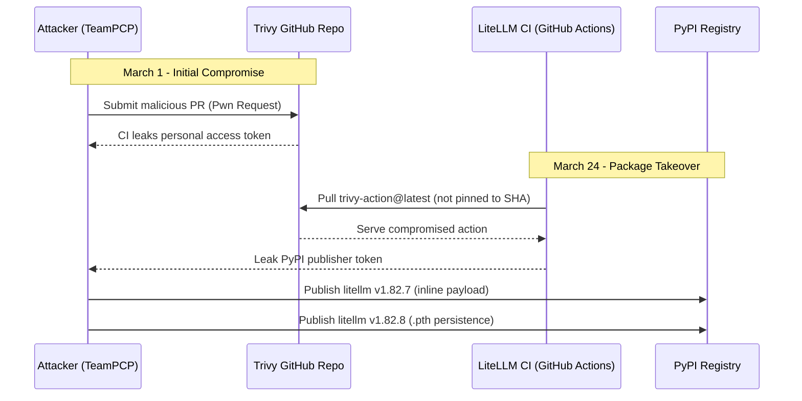
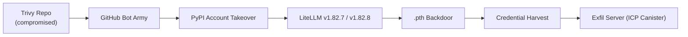
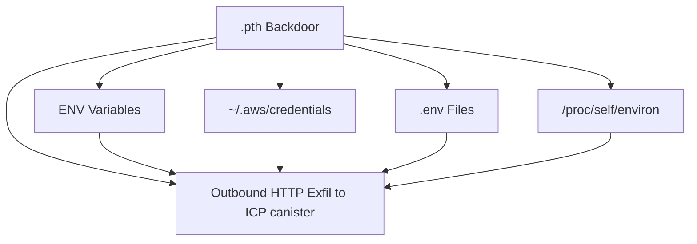

On March 24, 2026, Callum McMahon at FutureSearch was testing a Cursor MCP plugin that pulled in litellm as a transitive dependency. Shortly after, his machine became unresponsive. He traced it to a newly installed litellm package.

## What Is LiteLLM?

LiteLLM is a Python library that works like a universal remote for AI APIs. 95 million downloads per month on PyPI. ~40,000 GitHub stars.

## The Attack Chain





## What the Malware Does

The payload was triple-nested: a base64 blob decodes to an orchestrator script, which decodes a second base64 blob containing the harvester.



Two versions were published:
- v1.82.7: injected payload at line 128 of `litellm/proxy/proxy_server.py`
- v1.82.8: added a `.pth` file that executes every time Python starts

> `.pth` files in `site-packages` execute code before your application begins, on every Python invocation: pytest, IDE language server, even pip install.

## Check Your Environment

```bash
ls ~/.config/sysmon/sysmon.py 2>/dev/null && echo "BACKDOOR FOUND"
find $(python3 -c "import site; print(' '.join(site.getsitepackages()))") \
  -name "litellm_init.pth" 2>/dev/null
```

> If anything shows up, upgrading the package is not enough. Rotate all LLM provider API keys, cloud credentials, GitHub and PyPI tokens, CI/CD secrets, and SSH keys. Rebuild from known-good images. The last known-clean version is 1.82.6.
