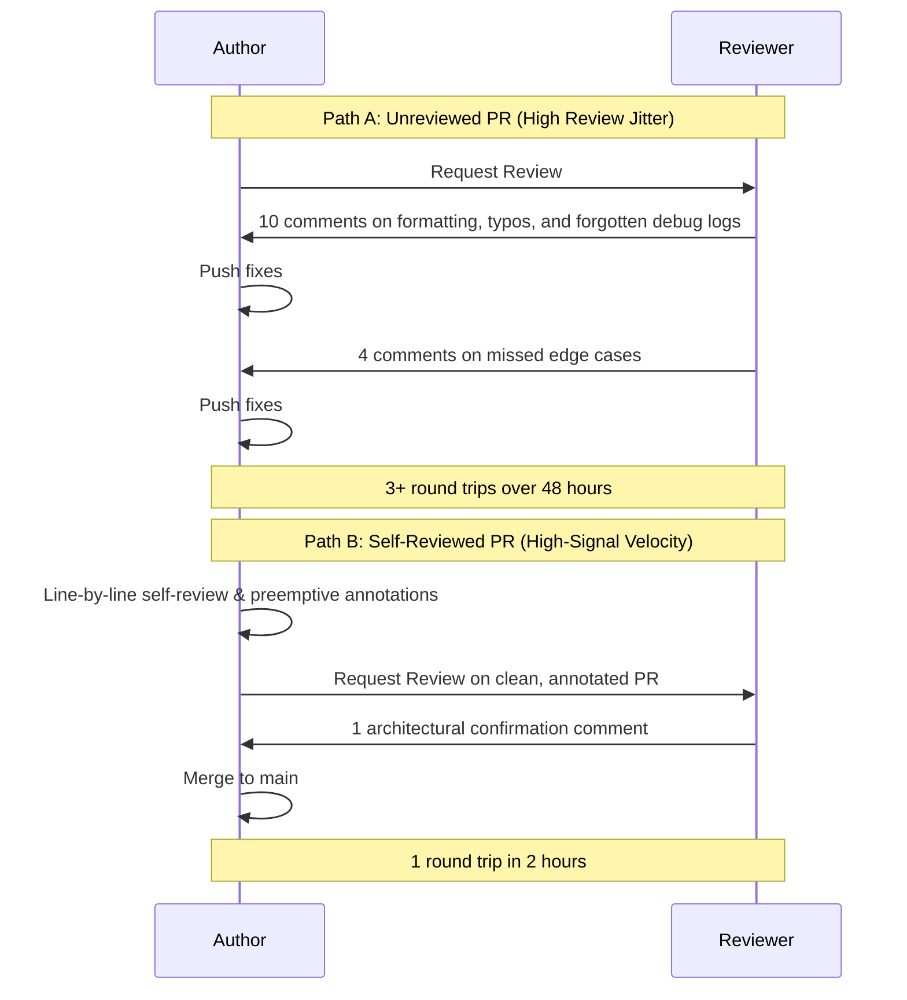

The highest-leverage habit for accelerating code review turnaround is conducting a rigorous, line-by-line self-review in the web diff viewer before requesting reviews from colleagues.

In software teams, code reviews are asynchronous. Every review round-trip introduces context switching overhead and delays deployment by hours or days.



## The Five-Step Self-Review Workflow

### 1. Review the Web Diff View in Isolation
Never rely solely on your local IDE diff. Open the GitHub or GitLab "Files changed" tab in split view. Stepping outside the editing environment forces your brain to read the code as a consumer rather than the author.

### 2. Scrub Diff Churn and Accidental Changes
Look for noise that pollutes the PR:
- Unintentional whitespace or auto-formatting shifts in untouched files
- Commented-out dead code or temporary debugging print statements
- Dependency lockfile churn caused by experimental package installations

### 3. Add Preemptive Author Annotations
If a section of code looks unusual, counterintuitive, or deliberately complex, add an inline comment on your own PR before your reviewer sees it:

```
// Author Note:
"Using sync/atomic here instead of a mutex because this runs on 
the 50k rps authorization ingress path. Benchmark results linked in PR description."
```

Preemptive comments immediately answer the reviewer's first question, preventing an unnecessary round-trip comment asking for justification.

### 4. Verify Failure Paths in Tests
Review your newly added unit tests in the diff:
- Do tests verify error branches as thoroughly as happy paths?
- Are edge cases (nil inputs, empty slices, boundary limits) explicitly asserted?
- Are test names descriptive of the failure mode being protected?

### 5. Structure the PR Summary with Evidence
A high-signal PR description answers three questions succinctly:
1. **What**: The concrete functional change.
2. **Why**: The technical motivation or incident ticket reference.
3. **Verification**: The exact commands run and evidence of success (e.g. `go test -race ./pkg/auth/...` passing with benchmark metrics).

## Operational Rules

1. **Keep diffs under 400 lines**: Review quality drops precipitously on PRs exceeding 400 lines of modified code. Split large changes into sequential, stackable PRs.
2. **Never ping reviewers before self-reviewing**: A reviewer's time should be spent validating system architecture and race conditions, not flagging leftover formatting discrepancies.
3. **Automate formatting via CI**: Formatting and linting should be enforced entirely by pre-commit hooks and CI gates, keeping human reviews focused on technical correctness.
