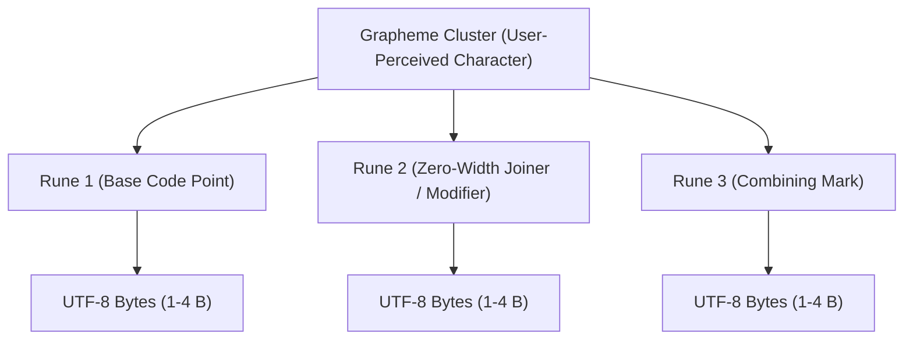
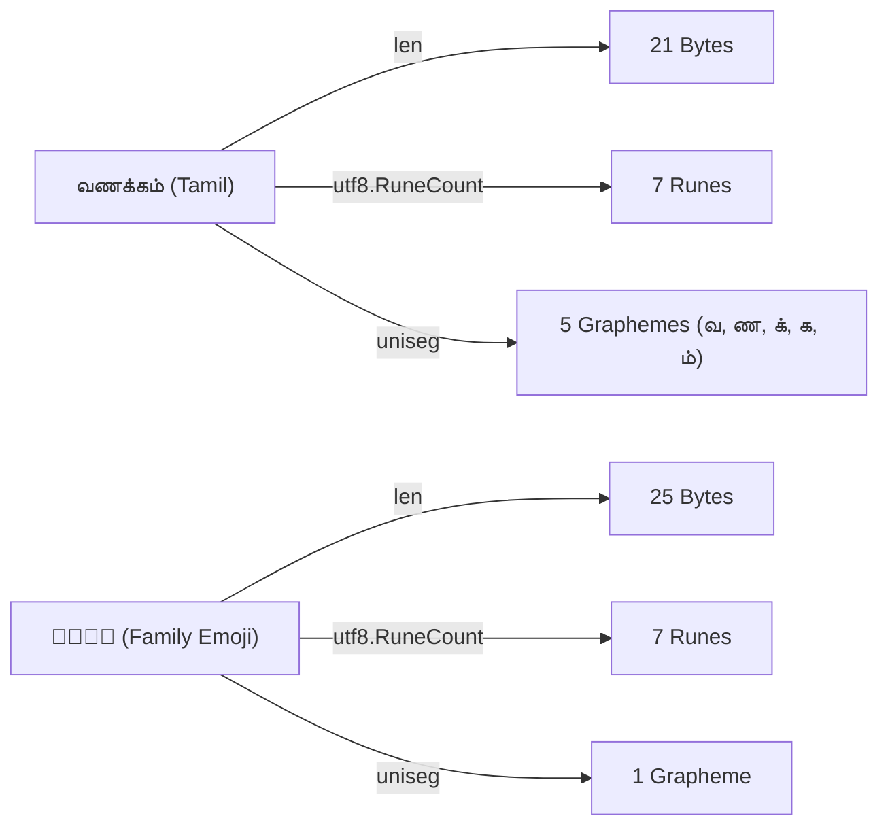

Text processing in Go operates across three distinct layers of abstraction: **bytes**, **runes** (Unicode code points), and **extended grapheme clusters** (user-perceived characters).

Treating code points or bytes as visible characters corrupts non-Latin scripts (like Tamil, Hindi, or Arabic) and multi-code-point emoji sequences.



## 1. Bytes: UTF-8 Storage Layer

In Go, a `string` is an immutable, read-only slice of arbitrary bytes. The built-in `len(s)` function returns the number of **bytes**, not characters:

```go
s := "வணக்கம்"
fmt.Println(len(s)) // 21 bytes (3 bytes per Tamil code point)
```

Direct indexing `s[0]` extracts a raw `uint8` byte. If you slice a multi-byte UTF-8 sequence halfway through (`s[:2]`), you produce invalid, corrupted UTF-8.

## 2. Runes: Unicode Code Points

A `rune` in Go is an alias for `int32`, representing a single Unicode Code Point:

```go
rs := []rune(s)
fmt.Println(len(rs)) // 7 runes
```

While `[]rune(s)` converts a string to code points, it allocates a new slice on the heap. For zero-allocation iteration, use a `range` loop or the standard library `unicode/utf8` package:

```go
import "unicode/utf8"

// Zero heap allocation
count := utf8.RuneCountInString(s) // 7
```

## 3. Grapheme Clusters: User-Perceived Characters

A single visible character often consists of multiple Unicode code points joined together.

### Example A: Tamil Syllables with Virama
In the word `"வணக்கம்"`, the syllable `"க்"` combines two independent code points:
- Base consonant: `க` (`U+0B95`)
- Pulli / Virama combining mark: `்` (`U+0BCD`)

To a human reader, `"க்"` is 1 character, but to Go's `[]rune`, it is 2 runes.

### Example B: Zero-Width Joiner (ZWJ) Emoji
Consider the family emoji sequence: `👨‍👩‍👧‍👦`

```go
emoji := "👨‍👩‍👧‍👦"
fmt.Println(len(emoji))                    // 25 bytes
fmt.Println(utf8.RuneCountInString(emoji)) // 7 runes (Man + ZWJ + Woman + ZWJ + Girl + ZWJ + Boy)
```

If you slice this emoji by rune or reverse it with a naive rune loop, the family breaks apart into four separate individuals separated by invisible joiners.



## Proper Grapheme Iteration with `uniseg`

Go's standard library stops at code points (`rune`). For Unicode Standard Annex #29 compliant grapheme clustering, use `github.com/rivo/uniseg`:

```go
package main

import (
    "fmt"
    "slices"
    "github.com/rivo/uniseg"
)

// ReverseGraphemes reverses a string without breaking combining marks or ZWJ sequences
func ReverseGraphemes(s string) string {
    var clusters []string
    gr := uniseg.NewGraphemes(s)
    for gr.Next() {
        clusters = append(clusters, gr.Str())
    }
    slices.Reverse(clusters)

    var result string
    for _, c := range clusters {
        result += c
    }
    return result
}

func main() {
    fmt.Println(ReverseGraphemes("வணக்கம்")) // ம் க க் ண வ (Valid Tamil graphemes preserved)
}
```

## Text Processing Reference

| Objective | Technique | Allocation Profile |
|---|---|---|
| **Byte count** | `len(s)` | Zero allocation |
| **Code point count** | `utf8.RuneCountInString(s)` | Zero allocation |
| **Decode code points** | `for idx, r := range s` | Zero allocation |
| **Visible character count** | `uniseg.GraphemeClusterCount(s)` | Zero allocation |
| **Safe truncation / display** | Segment on grapheme boundaries via `uniseg` | Minimal slice allocation |
