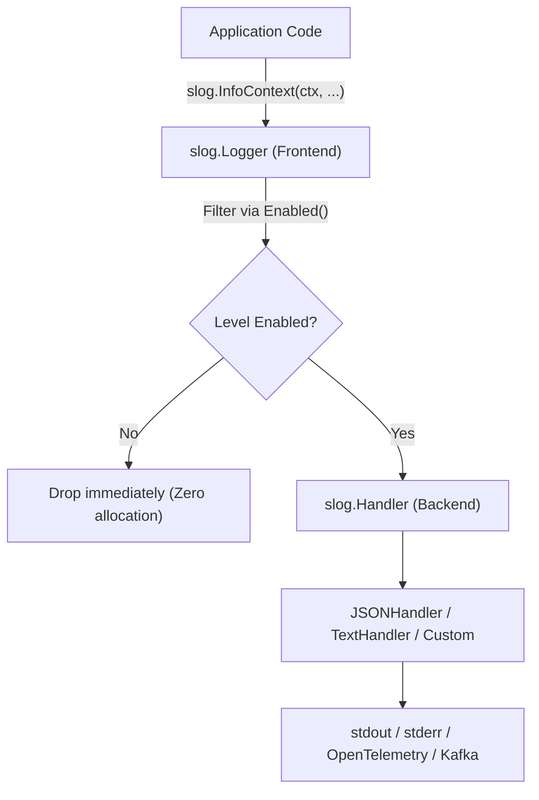

Since Go 1.21 introduced `log/slog` to the standard library, third-party structured loggers like `zerolog` and `uber-go/zap` are no longer strict requirements for high-throughput production services.

`slog` decouples the front-end logging API from the backend formatting layer, standardizes logging across library ecosystems, and provides type-safe value masking.

## The Handler Architecture

The central architectural pattern in `slog` is the `slog.Handler` interface:

```go
type Handler interface {
    Enabled(context.Context, Level) bool
    Handle(context.Context, Record) error
    WithAttrs(attrs []Attr) Handler
    WithGroup(name string) Handler
}
```



Because third-party libraries and framework middlewares can accept a `*slog.Logger` or `slog.Handler`, your entire stack converges on a single logging pipeline without translation layers between competing logger interfaces.

## Masking Sensitive Data with `slog.LogValuer`

In payment and security-critical systems, accidental logging of personally identifiable information (PII) or Primary Account Numbers (PAN) is a major compliance risk.

`slog` solves this via the `slog.LogValuer` interface. Any type implementing `LogValue() slog.Value` automatically masks itself when passed to any `slog` logger:

```go
package payments

import (
    "log/slog"
    "strings"
)

type CreditCard struct {
    PAN    string // e.g. "4111222233334444"
    CVV    string
    Expiry string
}

// LogValue implements slog.LogValuer to prevent raw PAN leakage in logs
func (cc CreditCard) LogValue() slog.Value {
    if len(cc.PAN) < 4 {
        return slog.StringValue("REDACTED")
    }
    masked := strings.Repeat("*", len(cc.PAN)-4) + cc.PAN[len(cc.PAN)-4:]
    return slog.GroupValue(
        slog.String("pan", masked),
        slog.String("expiry", cc.Expiry),
        // CVV is omitted entirely
    )
}
```

When logged with `slog.Info("authorization request", "card", card)`, the output safely outputs masked fields:

```json
{"time":"2026-03-10T12:00:00Z","level":"INFO","msg":"authorization request","card":{"pan":"************4444","expiry":"12/28"}}
```

## Performance: Loosely Typed vs Typed `slog.Attr`

`slog` offers two calling conventions:

1. **Loosely typed key-value pairs**: `slog.Info("msg", "key", val)`
2. **Strongly typed attributes**: `slog.Info("msg", slog.String("key", val))`

In hot paths (e.g. payment authorization ingress), loose key-value pairs cause each value to be boxed into `any`, triggering heap allocations. Strongly typed `slog.Attr` constructors (`slog.String`, `slog.Int64`, `slog.Duration`) store values directly in stack-friendly value structs:

```go
// Allocation-heavy: 2 interface{} boxing allocations
logger.InfoContext(ctx, "transaction processed", "account_id", accID, "amount_cents", amount)

// Zero boxing allocations: stack-allocated Attr structs
logger.LogAttrs(ctx, slog.LevelInfo, "transaction processed",
    slog.String("account_id", accID),
    slog.Int64("amount_cents", amount),
)
```

## When to Use `slog` vs `zerolog`

| Metric / Feature | `log/slog` | `zerolog` |
|---|---|---|
| **Ecosystem Standard** | Standard library (built-in Go 1.21+) | Third-party dependency |
| **Interface Composability** | Clean `Handler` middleware chain | Custom `io.Writer` pipeline |
| **PII / Secret Masking** | First-class `LogValuer` interface | Custom event hooks |
| **Allocation Profile** | Low (zero-alloc with `LogAttrs`) | Zero-alloc (writes directly to JSON byte buffer) |
| **API Style** | Standard Go idioms (`context.Context` first) | Fluent chaining (`log.Info().Str(...).Msg()`) |

For greenfield services and shared libraries, `log/slog` is the correct default. The slight raw throughput advantage of `zerolog` rarely outweighs the maintainability, security, and ecosystem compatibility of the standard library.
