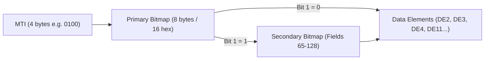

ISO 8583 is the international standard governing financial transaction card originated messages across point-of-sale terminals, ATMs, and global card networks (Visa, Mastercard, RuPay).

Every financial message begins with a 4-digit **Message Type Identifier (MTI)** (such as `0100` for an authorization request or `0200` for a financial presentment), followed immediately by one or more **bitmaps** that define the exact schema of data elements present in the payload.



## How Bitmaps Work

A bitmap is a compact bitmask where bit position $N$ indicates whether Data Element $N$ is present in the message body:

- **1-based bit indexing**: Unlike standard programming indices starting at 0, ISO 8583 field numbering begins at **1**. Bit 1 corresponds to the Most Significant Bit (MSB) of the first byte (`0x80` or `1 << 63`).
- **Primary Bitmap (Fields 1 to 64)**: Always present; spans exactly 8 bytes (64 bits).
- **Secondary Bitmap (Fields 65 to 128)**: Present if and only if **Bit 1** of the primary bitmap is set to `1`.
- **Tertiary Bitmap (Fields 129 to 192)**: Defined in ISO 8583:1993/2003; present if and only if **Bit 65** (Bit 1 of the secondary bitmap) is set to `1`.

```
Byte 0              Byte 1              ... Byte 7
[b1 b2 b3 b4 b5 b6 b7 b8] [b9 ... b16]        ... [b57 ... b64]
 ^                         ^
 |                         +-- Field 9 (Conversion Rate)
 +-- Secondary Bitmap Flag (1 = Present, 0 = Absent)
```

## Binary vs Hexadecimal ASCII Formats

Depending on the network specifications, bitmaps are transmitted in two formats:

1. **Packed Binary**: 8 bytes for primary (or 16 bytes with secondary). Common in raw TCP host interfaces (e.g. Visa SMS / Base I).
2. **Hexadecimal ASCII**: 16 characters for primary (or 32 characters with secondary), encoded in readable ASCII (e.g. `"7238241128018400"`). Common in AS 2805 and HTTP/JSON bridge protocols.

## Robust Bitmap Unpacker in Go

Here is a production Go implementation that parses both binary and hex formats and provides constant-time $O(1)$ field presence lookups:

```go
package iso8583

import (
    "encoding/binary"
    "encoding/hex"
    "errors"
    "fmt"
)

type Bitmap struct {
    Primary      uint64
    Secondary    uint64
    HasSecondary bool
}

var (
    ErrInvalidLength = errors.New("insufficient data for ISO 8583 bitmap")
    ErrInvalidField  = errors.New("field number must be between 1 and 128")
)

// ParseBinaryBitmap unpacks raw 8 or 16 byte packed bitmaps
func ParseBinaryBitmap(data []byte) (Bitmap, int, error) {
    if len(data) < 8 {
        return Bitmap{}, 0, ErrInvalidLength
    }

    bm := Bitmap{
        Primary: binary.BigEndian.Uint64(data[:8]),
    }
    bytesRead := 8

    // Bit 1 is the MSB of the primary uint64 (1 << 63)
    if bm.Primary&(1<<63) != 0 {
        if len(data) < 16 {
            return Bitmap{}, 0, fmt.Errorf("secondary bitmap flagged but payload has only %d bytes", len(data))
        }
        bm.Secondary = binary.BigEndian.Uint64(data[8:16])
        bm.HasSecondary = true
        bytesRead = 16
    }

    return bm, bytesRead, nil
}

// ParseHexBitmap decodes 16 or 32 character ASCII hexadecimal bitmaps
func ParseHexBitmap(hexStr string) (Bitmap, int, error) {
    if len(hexStr) < 16 {
        return Bitmap{}, 0, ErrInvalidLength
    }

    raw, err := hex.DecodeString(hexStr)
    if err != nil {
        return Bitmap{}, 0, fmt.Errorf("malformed hex bitmap: %w", err)
    }

    return ParseBinaryBitmap(raw)
}

// IsSet checks whether a specific Data Element (1 to 128) is present
func (bm *Bitmap) IsSet(field int) (bool, error) {
    if field < 1 || field > 128 {
        return false, ErrInvalidField
    }

    if field <= 64 {
        // Field 1 maps to MSB (shift 63), Field 64 maps to LSB (shift 0)
        shift := 64 - field
        return (bm.Primary>>shift)&1 == 1, nil
    }

    if !bm.HasSecondary {
        return false, nil
    }

    shift := 128 - field
    return (bm.Secondary>>shift)&1 == 1, nil
}
```

## Parsing Sequential Data Elements

Because the bitmap defines the presence of all subsequent fields, the parser iterates through every set bit in ascending numerical order:

```go
func UnpackFields(bm *Bitmap, payload []byte) {
    // Common standard fields:
    // DE2:  Primary Account Number (PAN) - LLVAR
    // DE3:  Processing Code - 6 bytes numeric
    // DE4:  Amount, Transaction - 12 bytes numeric
    // DE11: Systems Trace Audit Number (STAN) - 6 bytes numeric
    // DE39: Action / Response Code - 2 bytes alphanumeric

    if ok, _ := bm.IsSet(3); ok {
        // Unpack 6-byte processing code (e.g. 000000 = Purchase)
    }
    if ok, _ := bm.IsSet(4); ok {
        // Unpack 12-byte transaction amount (e.g. 000000050000 = $500.00)
    }
    if ok, _ := bm.IsSet(39); ok {
        // Unpack 2-byte response code (e.g. 00 = Approved)
    }
}
```

## Architectural Takeaways

1. **The Bitmap IS the Schema**: ISO 8583 messages do not require separate JSON schema descriptors or XML DTDs. The bitmap acts as a self-describing wire manifest.
2. **Fixed Bit Allocation**: Always use bit shift math `(64 - field)` for Primary and `(128 - field)` for Secondary to maintain exact endian alignment across CPU architectures.
3. **Ascending Numerical Order**: Data elements always follow in exact sequential order of the active bits. No field can appear out of sequence.
