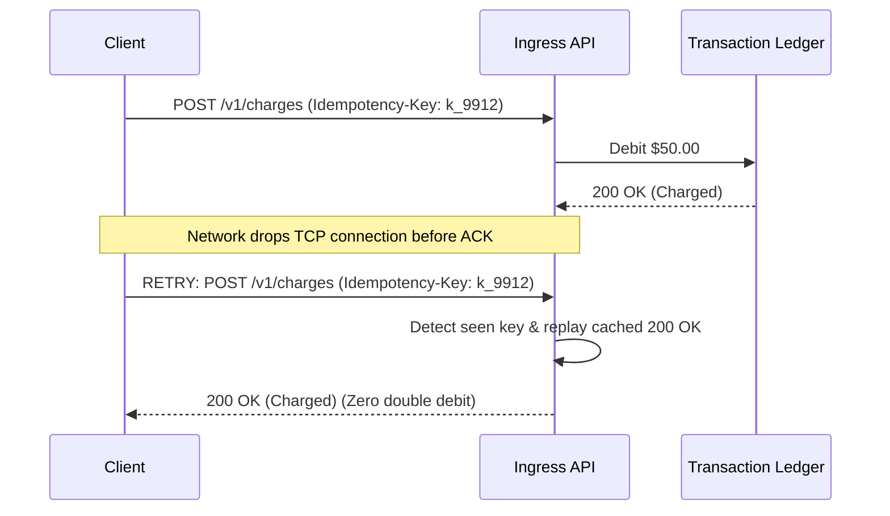
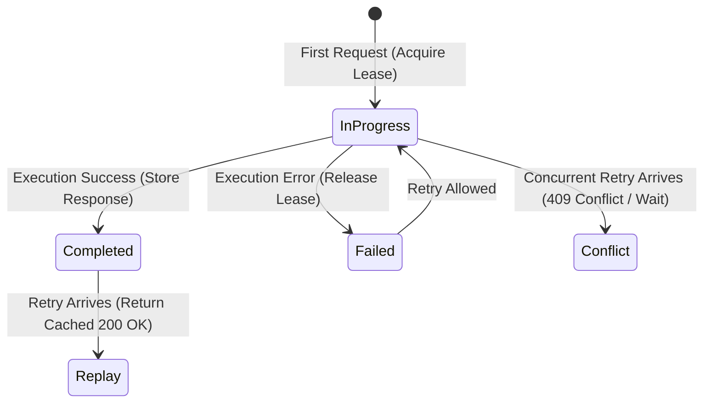

In payment processing, executing the same transaction twice is worse than dropping a request. A duplicate debit drains customer accounts, triggers chargebacks, and violates card network settlement rules.

Because network transport over WAN is inherently unreliable (the two-generals problem), client retries are inevitable. Idempotency guarantees that retrying an authorization request $N$ times produces the exact same side effects and response as executing it once.



## Why UUIDv7 Over UUIDv4 for Idempotency Keys

Clients must generate idempotency keys before sending the initial request. While arbitrary strings or UUIDv4 are common, **UUIDv7** (RFC 9562) is the superior standard for database-backed idempotency layers.

UUIDv7 embeds a 48-bit millisecond Unix timestamp in the most significant bits, followed by 74 bits of cryptographically secure pseudo-random entropy:

```
 0                   1                   2                   3
 0 1 2 3 4 5 6 7 8 9 0 1 2 3 4 5 6 7 8 9 0 1 2 3 4 5 6 7 8 9 0 1
+-+-+-+-+-+-+-+-+-+-+-+-+-+-+-+-+-+-+-+-+-+-+-+-+-+-+-+-+-+-+-+-+
|                           unix_ts_ms                          |
+-+-+-+-+-+-+-+-+-+-+-+-+-+-+-+-+-+-+-+-+-+-+-+-+-+-+-+-+-+-+-+-+
|          unix_ts_ms           |  ver  |       rand_a          |
+-+-+-+-+-+-+-+-+-+-+-+-+-+-+-+-+-+-+-+-+-+-+-+-+-+-+-+-+-+-+-+-+
|var|                        rand_b                             |
+-+-+-+-+-+-+-+-+-+-+-+-+-+-+-+-+-+-+-+-+-+-+-+-+-+-+-+-+-+-+-+-+
|                            rand_b                             |
+-+-+-+-+-+-+-+-+-+-+-+-+-+-+-+-+-+-+-+-+-+-+-+-+-+-+-+-+-+-+-+-+
```

### 1. B-Tree Index Locality
Random UUIDv4 strings scatter index writes randomly across the entire database B-tree, causing continuous page splits and cache eviction in the database buffer pool. UUIDv7 is monotonic; new records append naturally to the right-hand edge of the B-tree index.

### 2. Time-Range Expiration Without Secondary Indexes
Idempotency records are typically retained for 24 to 72 hours. Because UUIDv7 keys are time-ordered, background workers can prune expired records via simple range scans on the primary key without requiring a separate `created_at` index:

```sql
DELETE FROM idempotency_keys 
WHERE id < '018d0000-0000-7000-8000-000000000000'; -- Timestamp cutoff
```

## The Concurrent In-Flight Race Condition

A common failure in naive idempotency implementations occurs when a client times out after 2 seconds and fires a retry **while the first request is still executing in the database**.

If the second request checks the database and sees no completed record, both requests execute concurrently, causing a race condition and a double debit.



To solve this, the idempotency layer must implement a three-phase state machine:

1. **`IN_PROGRESS`**: When request 1 arrives, insert an atomic record with a short lease (e.g. 30 seconds).
2. **Concurrent Request Handling**: If request 2 arrives while the state is `IN_PROGRESS`, return `409 Conflict` (or block on a distributed pub/sub channel until request 1 completes).
3. **`COMPLETED`**: Once request 1 commits, save the HTTP status code, response headers, and response body. Subsequent retries instantly replay this cached payload.

## Request Payload Fingerprinting (SHA-256)

What happens if a malicious or buggy client sends an idempotency key with a charge of \$10, and then reuses the **same key** with a charge of \$1,000?

Under the IETF standard specification (`draft-ietf-httpapi-idempotency-key-header`), the server must compute a SHA-256 hash of the incoming request body and HTTP path:

```go
package idempotency

import (
    "crypto/sha256"
    "encoding/hex"
    "errors"
)

type Record struct {
    Key          string
    PayloadHash  string
    StatusCode   int
    ResponseBody []byte
    State        string // "IN_PROGRESS" | "COMPLETED" | "FAILED"
}

var ErrPayloadMismatch = errors.New("idempotency key reused with altered payload")

func ValidatePayload(rec *Record, rawBody []byte) error {
    h := sha256.Sum256(rawBody)
    currentHash := hex.EncodeToString(h[:])

    if rec.PayloadHash != currentHash {
        return ErrPayloadMismatch
    }
    return nil
}
```

If the payload hash does not match the stored hash for that key, reject the request immediately with `422 Unprocessable Entity` or `400 Bad Request`.

## Core Architectural Invariants

1. **Client-Side Generation**: The client must generate the UUID before initiating the HTTP request. If the server generates the key, dropped requests cannot be correlated on retry.
2. **Atomic Lease Acquisition**: Use database `INSERT ... ON CONFLICT DO NOTHING` or Redis `SET key in_progress NX EX 30` to guarantee only one worker executes the transaction.
3. **Payload Binding**: Always store and verify the SHA-256 digest of the request payload to prevent key collision tampering.
